# AI智能作业批改系统

> 基于 **FastAPI + Vue 3 + LangChain** 的全栈 AI 作业批改与教学辅助平台，支持多大模型接入、AI 自动批改、智能教学助手、文档查重等核心能力。


---

## 🏗️ 技术栈

### 前端

| 技术 | 说明 |
|------|------|
| Vue 3 + TypeScript | 渐进式前端框架，组合式 API |
| Vite 3 | 极速构建与热更新 |
| Element Plus | 企业级 UI 组件库 |
| Tailwind CSS 4 | 原子化 CSS 框架 |
| Vuex 4 | 状态管理 |
| Vue Router 4 | 前端路由与权限守卫 |
| ECharts 5 | 数据可视化图表 |
| WangEditor 5 | 富文本编辑器 |
| Axios | HTTP 请求库 |
| marked | Markdown 流式渲染 |

### 后端

| 技术 | 说明 |
|------|------|
| FastAPI 0.139 | 高性能异步 Web 框架 |
| Python 3.10+ | 运行环境 |
| SQLAlchemy 2.0 | ORM 框架 |
| MySQL 8.0 + PyMySQL | 关系型数据库 |
| Redis | Token 黑名单与缓存 |
| PyJWT + bcrypt | JWT 认证与密码加密 |
| LangChain 1.0 + LangGraph | AI Agent 框架 |
| httpx | 大模型 API 异步调用 |
| python-docx / pdfplumber | 文件解析（Word/PDF） |

---

## ✨ 功能总览

| 角色 | 核心功能 |
|------|----------|
| 管理员 | 数据看板、用户管理、角色权限、菜单配置、大模型配置、系统日志 |
| 教师 | 教学中心、班级管理、作业管理、AI批改规则、批改管理、**AI教学助手**、文档查重 |
| 学生 | 学习中心、班级与作业、提交作业、查看批改结果 |

---

## 📸 功能展示

### 🔐 统一认证系统


- 统一登录入口，支持管理员/教师/学生多角色
- JWT 令牌认证 + Redis Token 黑名单机制
- 首次登录强制修改密码
- bcrypt 密码加密存储


---

### 👨‍💼 管理员功能

#### 数据看板

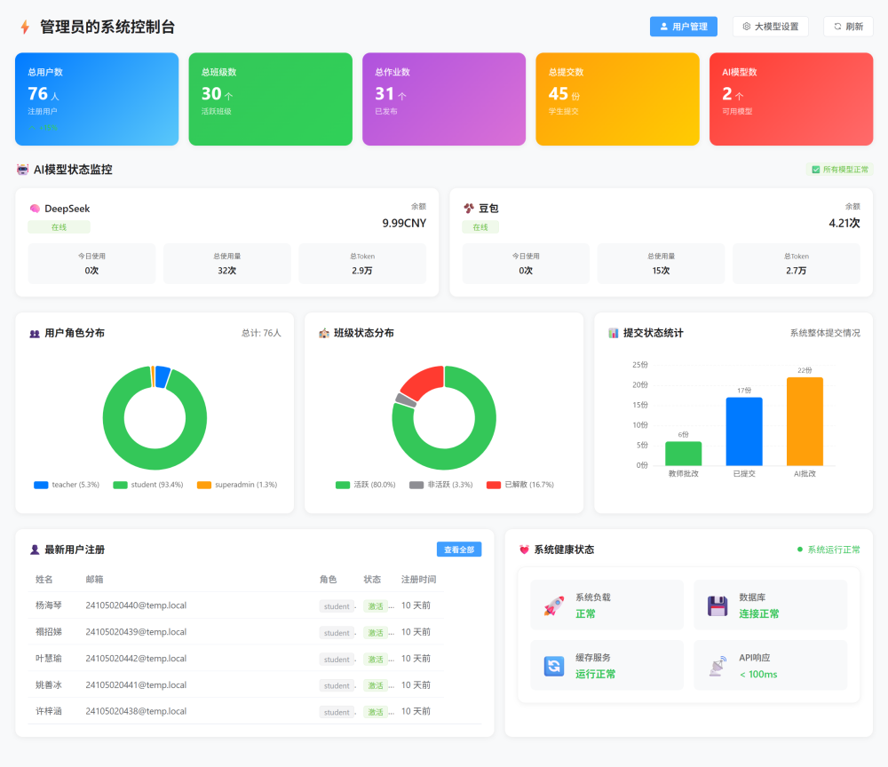

- 实时统计用户数量、作业数量、提交情况
- 多维度数据图表展示
- 系统运行状态监控

#### 系统配置

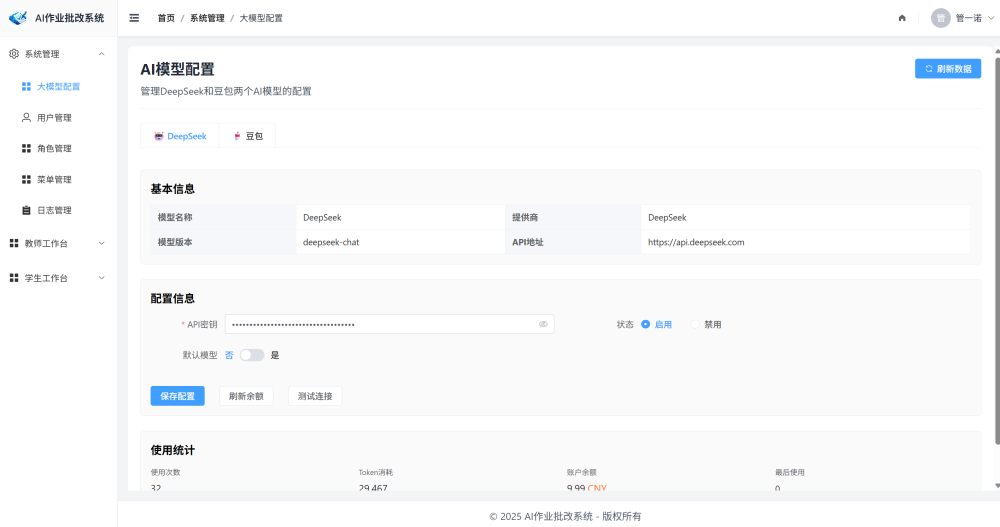

- **用户管理**: 批量导入、编辑、删除用户
- **角色管理**: 基于 RBAC 的权限分配
- **菜单管理**: 动态菜单配置
- **大模型配置**: 支持多种 AI 模型接入（DeepSeek、通义千问、豆包等）
- **系统日志**: 操作日志记录与审计

---

### 👨‍🏫 教师功能

#### 教学中心

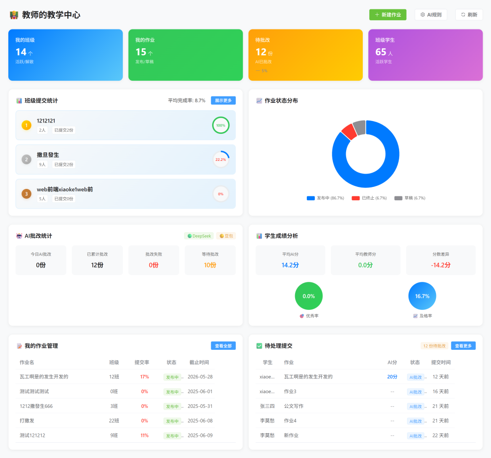

教师端主控台，一屏掌握班级状态、作业发布、AI 批改进度与学生成绩分析。

#### 1. 班级管理

**创建班级**
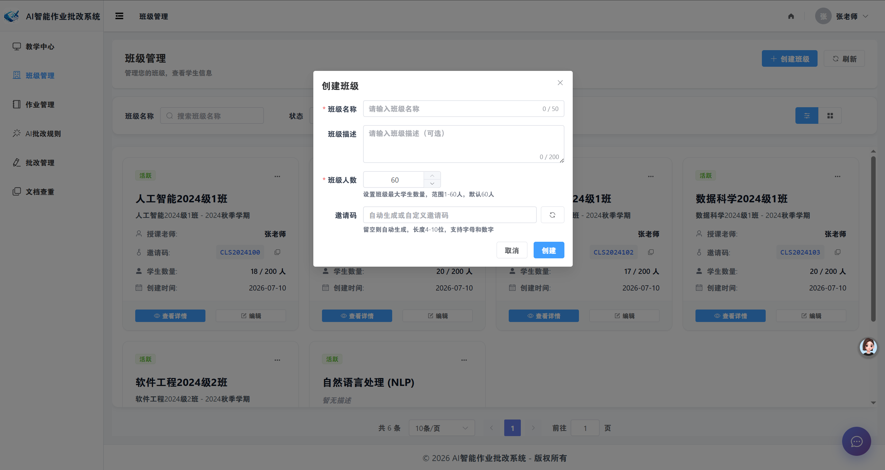

- 自定义班级名称、描述和邀请码
- 卡片式展示，支持搜索与筛选
- 班级详情与实时数据统计

**学生管理**
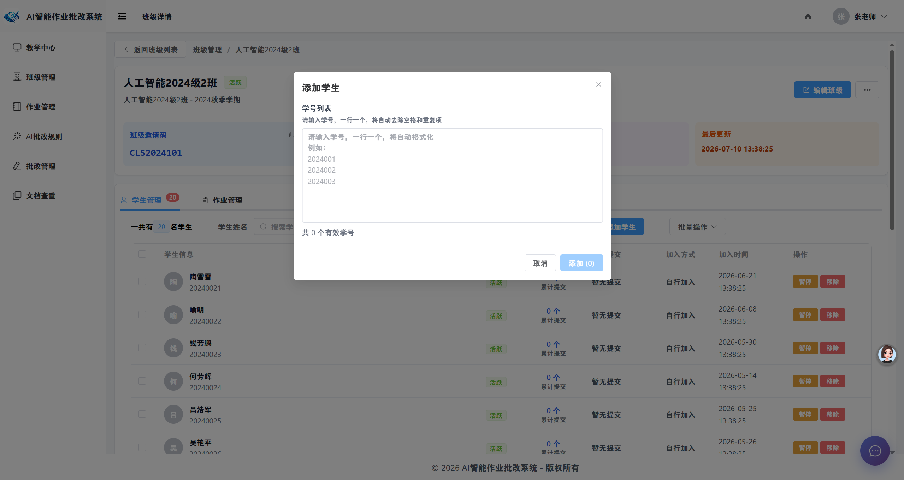

- 批量导入学生（Excel/CSV）
- 学生通过邀请码自主加入
- 学生状态管理（激活/暂停/移除）

#### 2. 作业管理

**发布作业**
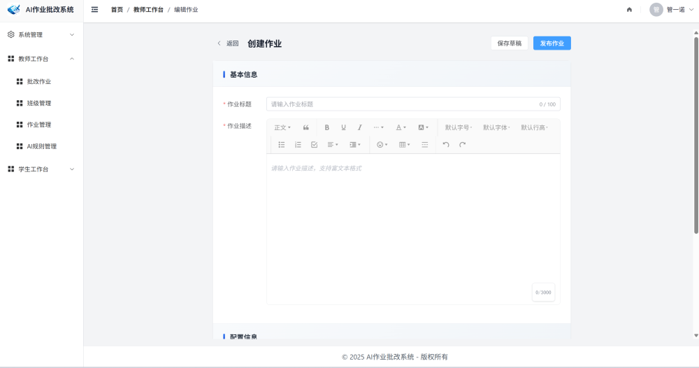

- 富文本编辑器支持多种格式
- 设置作业截止时间与关联班级
- 关联 AI 批改规则

**配置AI批改规则**


- 自定义评分标准与评价维度
- AI 提示词模板管理
- 规则复用与版本管理

#### 3. 作业批改

**查看作业详情**


- 学生提交列表与提交状态
- AI 批改进度实时更新
- 批改状态筛选

**人工审核打分**


- 查看 AI 批改结果与评分依据
- 人工复核与调整分数
- 详细评语反馈与批改记录追溯

#### 4. AI 教学助手

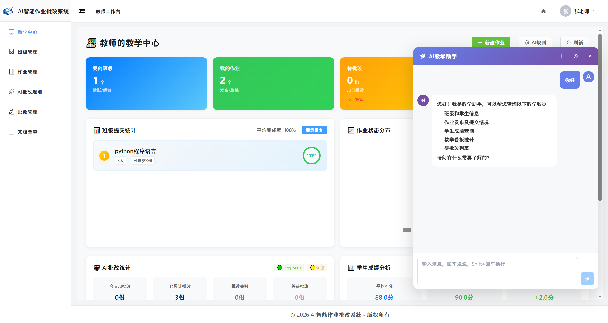

基于 **LangChain 1.0 + LangGraph** 构建的智能教学助手，以悬浮面板形式嵌入教师工作台，支持 SSE 流式对话，可实时查询教学数据：

- **班级和学生信息** — "我的班级有哪些学生？"
- **作业发布及提交情况** — "python程序语言作业提交了几份？"
- **学生成绩查询** — "张三的AI批改分数是多少？"
- **教学看板统计** — "今天AI批改了多少份作业？"
- **待批改列表** — "还有哪些作业等着我批改？"

> 助手通过 `ToolRuntime` 上下文注入 `teacher_id`，工具参数中不暴露教师身份，从根源避免 LLM 越权查询。每个工具内部使用独立数据库连接，保证线程安全。

#### 5. 文档查重

- 两两比对算法（字符 N-gram + TF-IDF 余弦相似度）
- 提交上限保护（单次最多 200 份）
- LRU 缓存避免重复计算

---

### 👨‍🎓 学生功能

#### 学习中心

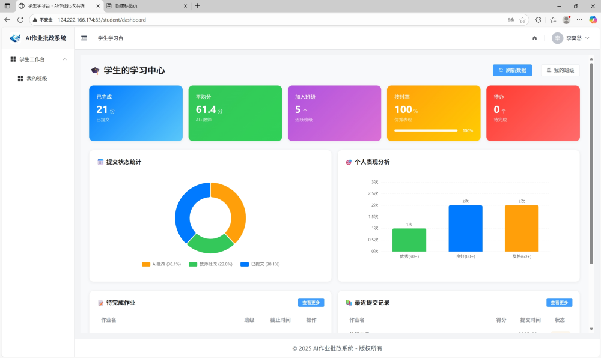

学生端主界面，展示所有班级和待完成作业。

#### 班级与作业

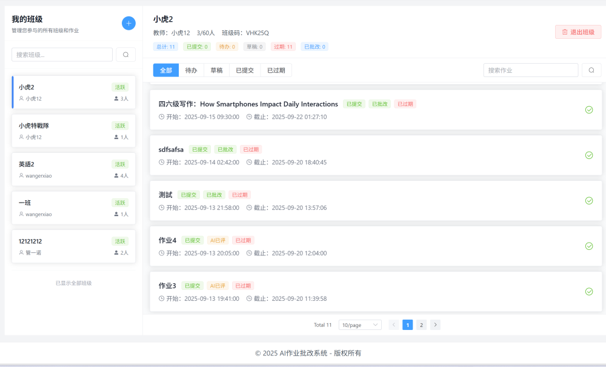

- 查看加入的班级列表
- 作业状态标识（待提交/已提交/已批改）

#### 提交作业


- 富文本编辑器答题
- 支持图片、附件上传（Word/PDF）
- 提交后自动触发 AI 批改

#### 查看结果

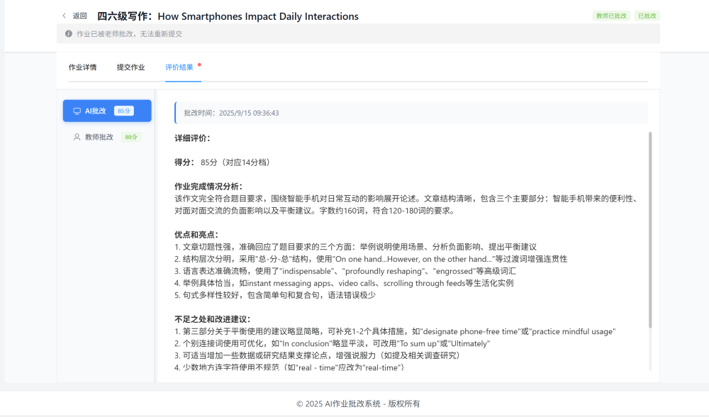

- AI 批改结果实时查看
- 详细评分维度展示
- 教师评语查看与历史记录

---

## 🚀 快速开始

### 环境要求

- Node.js >= 16.0
- Python >= 3.10
- MySQL >= 8.0
- Redis >= 6.0

### 克隆项目

```bash
git clone https://github.com/<your-username>/science_stop.git
cd science_stop
```

### 前端启动

```bash
cd frontend
npm install
npm run dev
```

访问 `http://localhost:5173` 即可查看项目。

### 后端启动

```bash
cd backend_python
pip install -r requirements.txt
cp .env.example .env      # 按需修改数据库连接信息
python seed.py            # 初始化数据库与种子数据

# 方式一：直接运行
python -m app.main

# 方式二：Uvicorn 热重载（开发推荐）
python -m uvicorn app.main:app --host 0.0.0.0 --port 83 --reload
```

启动后访问 API 文档: http://localhost:83/api/docs

### 默认账号

| 角色 | 账号 | 密码 |
|------|------|------|
| 超级管理员 | admin | admin123 |
| 教师 | teacher | 123456789 |
| 学生 | 2024001 | 123456789 |

---

## 📂 项目结构

```
science_stop/
├── frontend/                        # 前端项目 (Vue 3 + TypeScript + Vite)
│   ├── src/
│   │   ├── api/                     # API 服务层
│   │   │   ├── auth.ts              # 认证接口
│   │   │   ├── chat.ts              # SSE 流式对话
│   │   │   ├── assignment.ts        # 作业接口
│   │   │   └── ...
│   │   ├── assets/                  # 静态资源
│   │   ├── components/              # 公共组件
│   │   │   ├── AssistantPanel.vue   # AI 助手面板
│   │   │   ├── FloatingAssistantButton.vue
│   │   │   ├── WangEditor.vue       # 富文本编辑器
│   │   │   ├── PageHeader.vue       # 页面头部
│   │   │   └── AdaptiveTableContainer.vue
│   │   ├── config/                  # 配置文件
│   │   ├── hooks/                   # 自定义 Hooks
│   │   ├── layouts/                 # 布局组件
│   │   ├── router/                  # 路由与权限守卫
│   │   ├── store/                   # Vuex 状态管理
│   │   ├── types/                   # TypeScript 类型定义
│   │   ├── utils/                   # 工具函数 (request.ts 等)
│   │   ├── views/                   # 页面视图
│   │   │   ├── admin/               # 管理员页面
│   │   │   ├── teacher/             # 教师页面
│   │   │   │   ├── ai-rules/        # AI 批改规则
│   │   │   │   ├── assignments/     # 作业管理
│   │   │   │   ├── classes/         # 班级管理
│   │   │   │   ├── correcting/      # 批改管理
│   │   │   │   └── plagiarism/      # 文档查重
│   │   │   ├── student/             # 学生页面
│   │   │   └── dashboard/           # 仪表盘
│   │   ├── App.vue
│   │   └── main.ts
│   ├── package.json
│   └── vite.config.ts
│
├── backend_python/                  # 后端项目 (FastAPI + SQLAlchemy + LangChain)
│   ├── app/
│   │   ├── main.py                  # FastAPI 入口
│   │   ├── config.py                # 配置读取
│   │   ├── database.py              # SQLAlchemy 引擎与会话
│   │   ├── deps.py                  # 依赖注入
│   │   ├── core/                    # 核心模块
│   │   │   ├── security.py          # JWT + 密码加密
│   │   │   ├── response.py          # 统一响应格式
│   │   │   ├── exceptions.py        # 全局异常处理
│   │   │   ├── file_parser.py       # Word/PDF 文件解析
│   │   │   └── plagiarism.py        # 查重算法
│   │   ├── models/                  # 数据库模型
│   │   ├── schemas/                 # Pydantic 数据模型
│   │   ├── crud/                    # 数据库操作层
│   │   ├── routers/                 # API 路由
│   │   │   ├── auth.py              # 认证
│   │   │   ├── users.py             # 用户管理
│   │   │   ├── classes.py           # 班级
│   │   │   ├── assignments.py       # 作业
│   │   │   ├── submissions.py       # 提交
│   │   │   ├── correcting.py        # 批改
│   │   │   ├── chat.py              # AI 助手 SSE 流式接口
│   │   │   ├── plagiarism.py        # 查重
│   │   │   ├── ai_models.py         # 大模型配置
│   │   │   ├── ai_rules.py          # 批改规则
│   │   │   ├── dashboard.py         # 数据看板
│   │   │   └── ...
│   │   └── agent/                   # LangChain AI Agent
│   │       ├── agent.py             # Agent 构建与流式输出
│   │       └── tools.py             # Agent 工具集（5 个教学查询工具）
│   ├── uploads/                     # 上传文件目录
│   ├── seed.py                      # 种子数据初始化
│   ├── requirements.txt
│   └── .env.example
│
├── docs/                            # 项目文档与截图
├── .gitignore
├── LICENSE
└── README.MD
```

---

## 🎯 核心技术亮点

### 1. AI 智能批改

- 支持多种大模型接入（DeepSeek、通义千问、豆包等），管理员可在后台灵活配置
- 教师自定义批改规则、评分维度与 AI 提示词模板
- 学生提交作业后自动触发 AI 批改，结果包含分数 + 详细评语
- AI 分数解析失败时返回 `None` 并标注「请教师人工复核」，绝不生成随机分数

### 2. AI 教学助手（LangChain Agent）

- 基于 LangChain 1.0 `create_agent` + LangGraph 构建多工具 Agent
- 5 个教学数据查询工具：班级学生、作业提交、学生成绩、看板统计、待批改列表
- SSE 流式响应，逐字输出，实时对话体验
- 通过 `ToolRuntime` 上下文注入 `teacher_id`，LLM 无法越权查询其他教师数据
- Agent 工具内部使用独立数据库短连接，避免 SSE 长连接耗尽连接池

### 3. 文档查重

- 字符 N-gram + TF-IDF 余弦相似度两两比对
- 提交数量上限保护（200 份），防止 O(n²) 算法在高并发下阻塞
- OrderedDict LRU 缓存（maxsize=100），避免重复计算

### 4. 权限与安全

- 基于 RBAC 的角色权限控制，动态菜单生成
- JWT + Redis Token 黑名单，支持主动登出
- 文件上传大小限制（20MB），防止 OOM
- 前端路由守卫 + 后端接口双重鉴权

### 5. 性能优化

- 前端路由懒加载 + 组件按需加载
- 后端 N+1 查询全面消除（批量查询 + 字典映射）
- 分页过滤下推 SQL 层，保证 total 与页内数据一致
- SSE 流式生成期间不持有数据库连接（短事务模式）

---

## 📊 系统架构

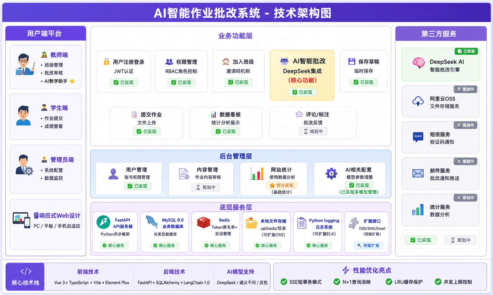

---

## 🌟 Star History

如果这个项目对你有帮助，欢迎给个 Star ⭐️
