# AI智能作业批改系统

> 基于 **FastAPI + Vue 3 + LangGraph 多智能体** 的全栈 AI 作业批改与教学辅助平台。三种角色（管理员/教师/学生）各自拥有专属 AI 助手；作业批改采用 Celery 异步多模态结构化批改（DeepSeek 视觉模型 + 分维度评分 + 总分后端汇总），并支持写操作人工审批、文档查重与操作审计。

---

## 🏗️ 技术栈

### 前端

| 技术 | 说明 |
|------|------|
| Vue 3 + TypeScript | 渐进式前端框架，组合式 API |
| Vite 3 | 极速构建与热更新（dev 端口 8080） |
| Element Plus | 企业级 UI 组件库 |
| Vuex 4 | 状态管理 |
| Vue Router 4 | 静态路由 + 按用户菜单动态注册（权限守卫） |
| ECharts 5 | 数据可视化图表 |
| WangEditor 5 | 富文本编辑器 |
| marked + DOMPurify | AI 回答 Markdown 安全渲染（防 XSS/外链数据外带） |
| Axios | HTTP 请求库（401 自动刷新重试） |
| Vitest | 前端单元测试 |

### 后端

| 技术 | 说明 |
|------|------|
| FastAPI 0.139 | 高性能异步 Web 框架 |
| Python 3.12 | 运行环境 |
| SQLAlchemy 2.0 | ORM 框架 |
| MySQL 8.0 | 业务数据库（用户/班级/作业/提交） |
| PostgreSQL 16 | AI 助手会话库（运行/步骤/审批/反馈） |
| Alembic ×2 | 双数据库独立迁移链 |
| LangChain 1.x + LangGraph | 多智能体编排（StateGraph + 结构化输出契约） |
| Celery + Redis | AI 批改异步任务队列（幂等投递 + 软超时） |
| PyJWT + bcrypt | JWT 认证与密码加密 |
| python-docx / pdfplumber / Pillow | 文件解析（Word/PDF/图片） |
| pytest | 后端测试（sqlite 替换双库，无需真实数据库） |

---

## ✨ 功能总览

| 角色 | 核心功能 |
|------|----------|
| 管理员 | 数据看板、用户管理、角色权限、菜单配置、大模型配置、班级管理、操作日志、**AI 管理助手**（运营分析/脱敏审计/模型治理） |
| 教师 | 教学中心、班级管理、作业管理、AI批改规则、批改管理、文档查重、**AI 教学助手**（数据查询/教学策略/**写操作审批闭环**） |
| 学生 | 学习中心、班级与作业、提交作业、查看批改结果、**AI 学习助手**（启发辅导/反馈解释/学习规划，**内置防代写**） |

---

## 📸 功能展示

### 🔐 统一认证系统

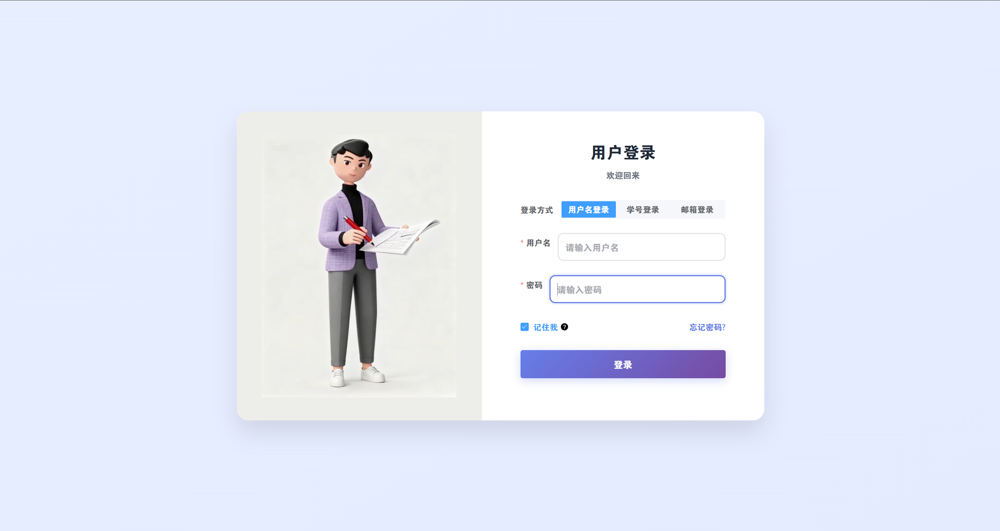

- 统一登录入口，支持用户名/学号/邮箱三种登录方式
- JWT 令牌认证 + Refresh Token 机制
- 首次登录强制修改密码
- bcrypt 密码加密存储

---

### 👨‍🏫 教师功能

#### 教学中心

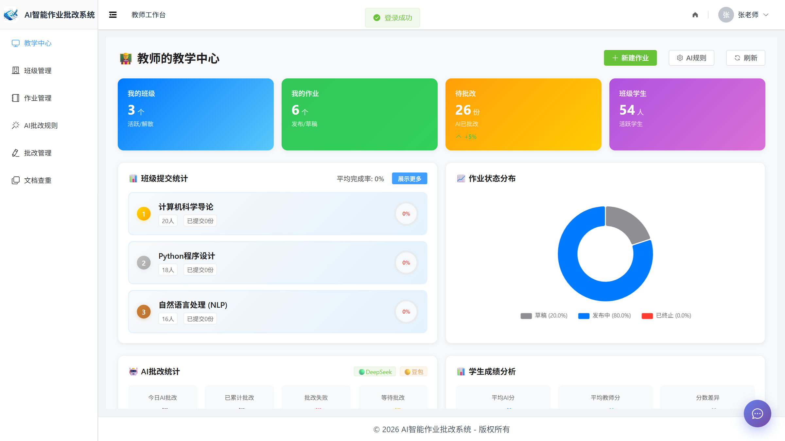

教师端主控台，一屏掌握班级状态、作业发布、AI 批改进度与学生成绩分析。

#### 1. 班级与作业管理

**创建班级**
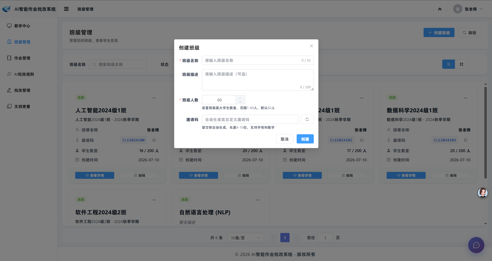

**发布作业**
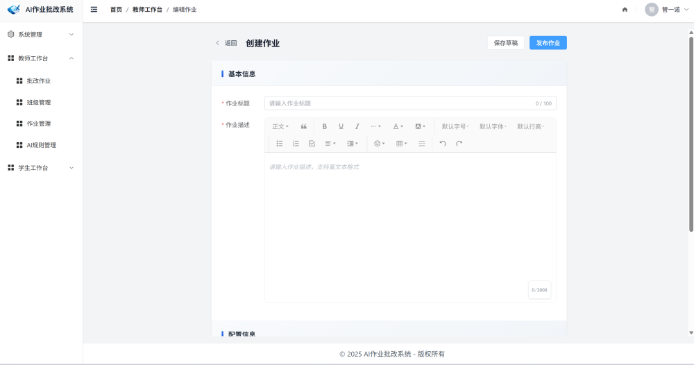

**配置AI批改规则**
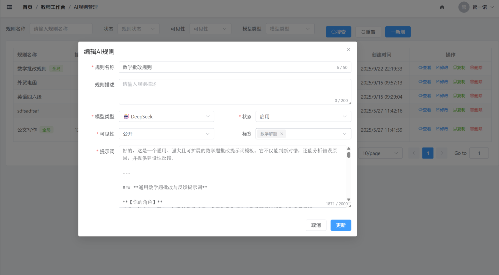

- 批量导入学生（Excel/CSV），学生通过邀请码自主加入
- 富文本作业描述 + 参考附件，关联 AI 批改规则
- 自定义评分标准、评价维度与提示词模板

#### 2. 作业批改

**查看作业详情**
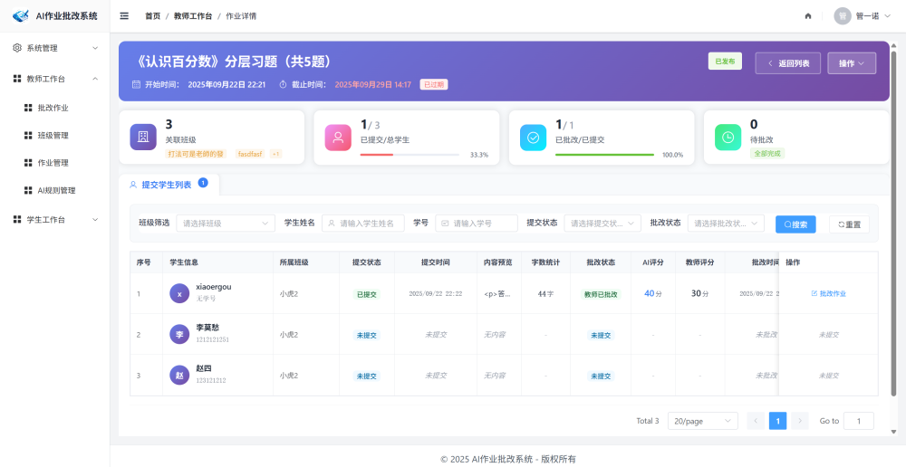

**人工审核打分**
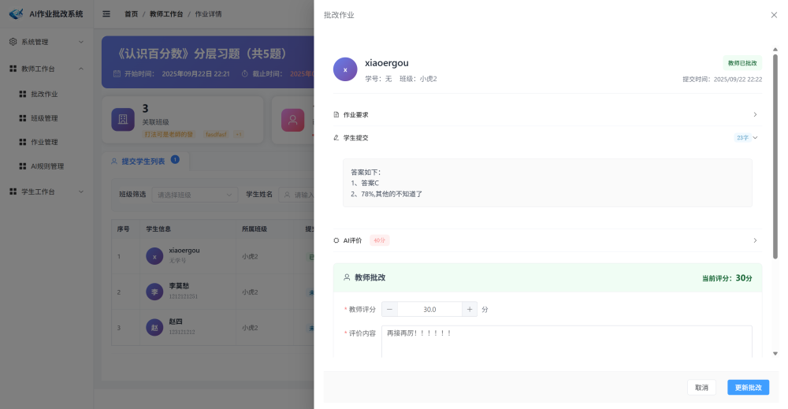

- 按作业规则选择一个多模态模型（DeepSeek `deepseek-v4-flash-vision-exp`），读取题目要求、教师参考附件、学生正文与图片/文档附件
- 结构化批改：模型按评分量表逐维度输出 JSON，经 pydantic 严格校验后由后端汇总总分（不信任模型自算分数），批改温度 `0.1` 保证同量表评分一致
- 结构化校验失败或调用失败时转教师人工批改，原始输出留证；教师可复核、调整分数并留痕

#### 3. AI 教学助手（多智能体）

**实时运行时间线** —— 提问后每个 Agent 的执行进度实时可见：

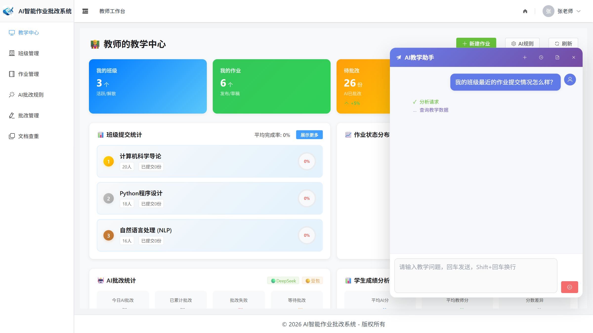

**数据查询与回答溯源** —— 回答标注数据引用条数与安全审核结果，支持 👍/👎 反馈：

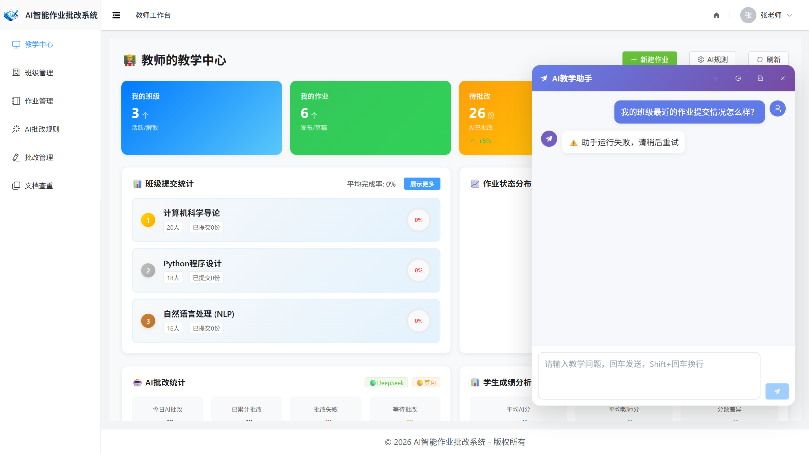

**写操作审批闭环** —— 对助手说「发布/修改/删除作业」只会生成待审批草案，教师在审批面板看到**字段级差异对比**后确认才会执行：

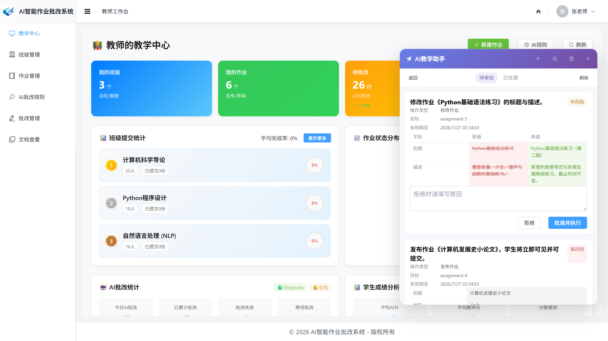

- 意图路由：教学数据查询 / 教学策略建议 / 写操作起草 / 白名单外写请求明确拒绝
- 每个回答经独立安全审核 Agent 复核后才逐段放行，绝不"先流出再撤回"
- 审批草案服务端哈希签名 + 幂等键，执行前逐字节复验载荷与对象归属

#### 4. 文档查重

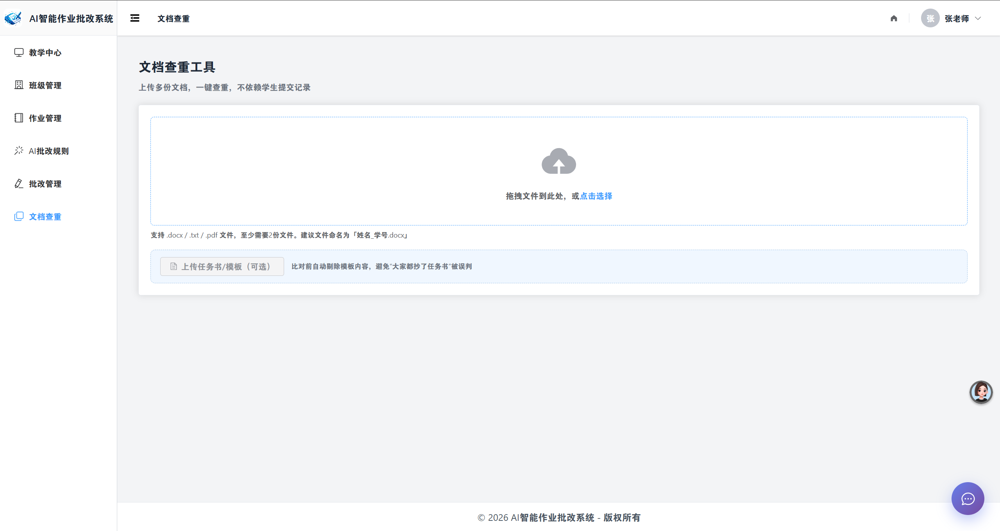

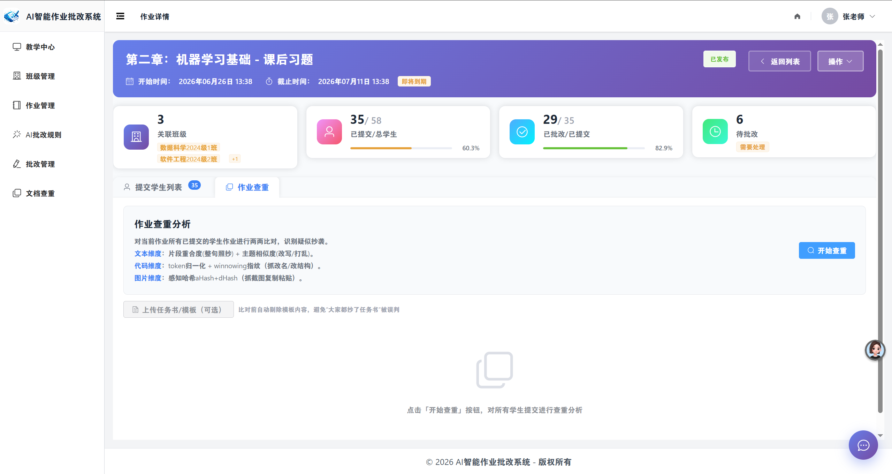

**双维度查重引擎**（文本 + 图片），支持临时上传查重和作业内查重两种模式：

- **文本维度**：字符 N-gram 重叠系数（抓整句照抄）+ jieba 分词 TF-IDF 余弦相似度（抓同义替换/语序打乱）
- **图片维度**：感知哈希（aHash + dHash）+ 汉明距离，检测截图复制粘贴
- **综合重复率** = 片段重合度 × 片段权重 + 主题相似度 × 主题权重，阈值权重前端可调
- 模板剔除 + 自动公共片段识别，避免同题作业误判；单次上限 200 份，LRU 缓存
- 查重结果可由 AI 生成人话解释（解释 Agent 只能解读、禁止改数值或下抄袭定性，经审核后输出）

---

### 👨‍🎓 学生功能

#### 学习中心


#### 提交作业与查看结果

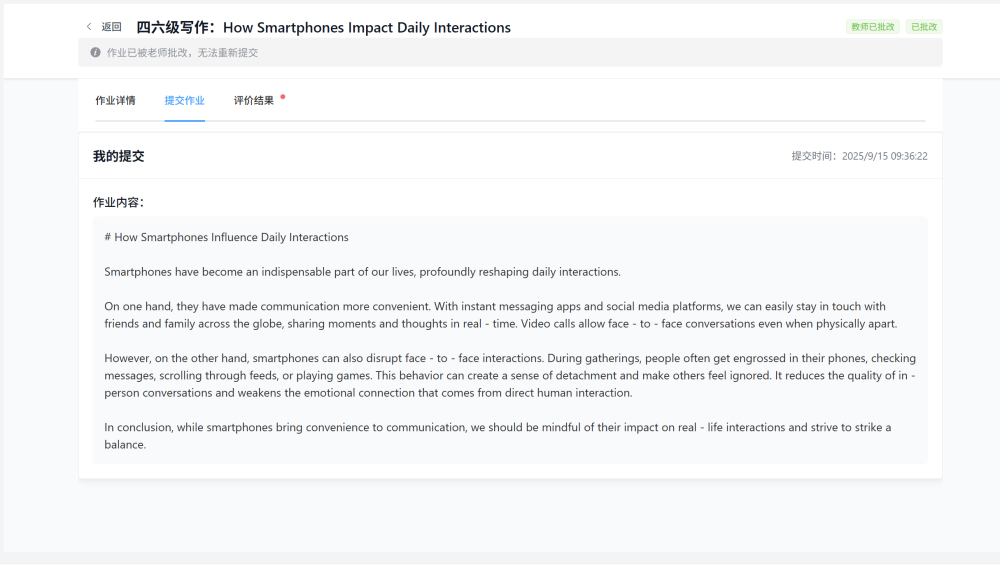


- 富文本答题 + 图片/附件上传（Word/PDF），提交后自动触发 AI 多模态批改
- 批改进度实时轮询，AI 总分、评语与教师复核结果可追溯

#### AI 学习助手（防代写设计）

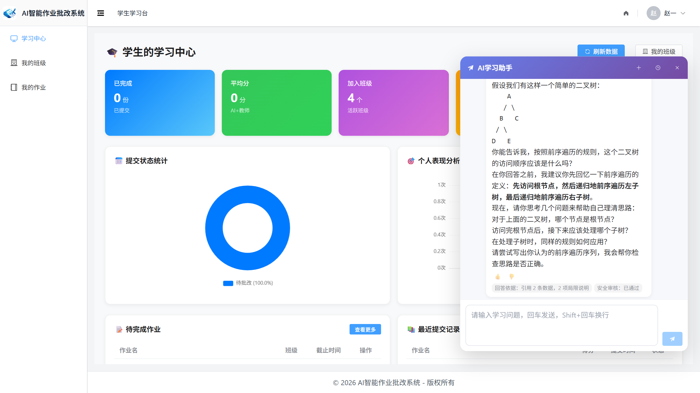

- **启发式辅导**：苏格拉底式提问引导思路，不直接给可提交的完整答案
- **三层防代写**：关键词识别 + LLM 意图兜底 + 服务端题面相似度比对（学生请求与进行中作业题面 4-gram 重合率超阈值即拒绝）
- 反馈解释、学习规划仅基于本人数据，回答须携带服务端验证的证据引用

---

### 👨‍💼 管理员功能

#### 数据看板与系统管理

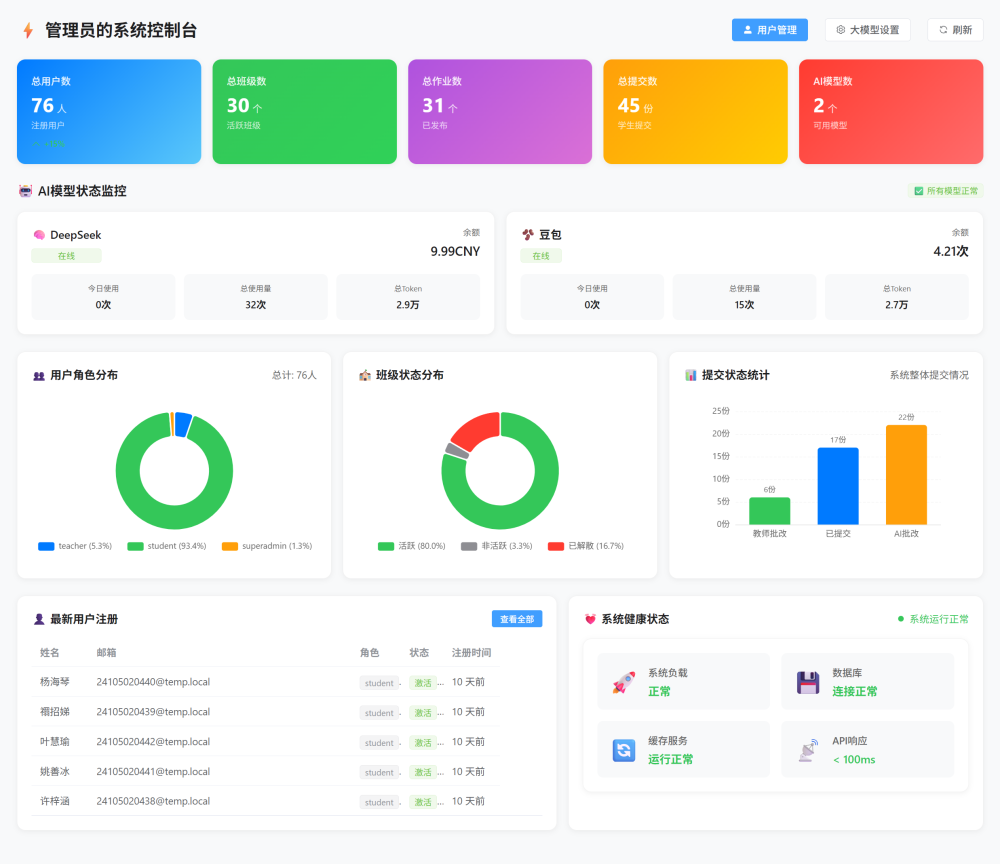


- **用户管理**: 批量导入、编辑、删除用户（含关联数据自动清理）
- **角色管理**: 基于 RBAC 的权限分配；**菜单管理**: 动态菜单配置
- **班级管理**: 管理员可代任意教师创建/编辑/解散班级，更换授课教师
- **AI模型配置**: 多模型接入、真实测试连接、查询余额、能力标签（多模态/文本）与档位绑定、模型默认互斥
- **操作日志**: 中间件自动记录所有管理操作，支持筛选，不可篡改

#### AI 管理助手

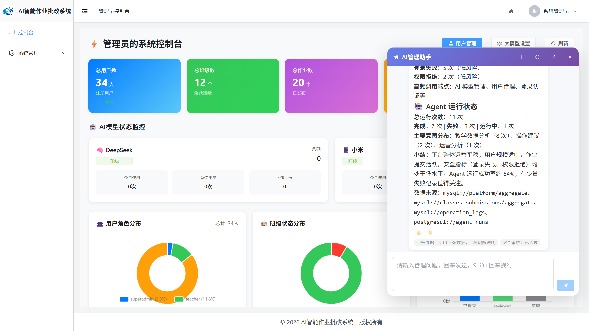

- **运营分析**：用户规模、班级活跃度、作业提交量聚合统计
- **脱敏审计**：登录失败/权限拒绝/高频端点聚合、Agent 运行成功率——只碰聚合数字，绝不透出用户明文数据
- **模型治理**：Token 用量与成本分析、连通性探测（密钥自动脱敏）；配置变更只生成提案，须人工审批

---

## 🤖 多智能体架构

每个角色一张 LangGraph 状态图，统一拓扑：**意图路由 → 专家 Agent → 独立安全审核 → 输出**。

```
用户消息 ──▶ 角色主管（关键词路由，未命中时单次 LLM 兜底分类）
              │
              ├─ 教师图：数据查询 / 教学策略 / 写操作起草（→ 审批草案）
              ├─ 学生图：启发辅导 / 反馈解释 / 学习规划 / 代写拒绝
              └─ 管理员图：运营分析 / 脱敏审计 / 模型治理
                            │
                    独立最终审核 Agent（不持有工具）
                            │ 驳回→回退修订一次，再驳回→安全降级
                            ▼
              审核通过后按段落逐段流式放行（SSE）
```

**关键安全设计**：

- **证据验证**：专家 Agent 声明的每条数据引用都与真实工具返回比对，编造的引用被服务端剔除并标注
- **身份隔离**：`teacher_id`/`student_id` 由服务端上下文注入，绝不出现在 LLM 工具参数中，越权查询无从谈起
- **写操作零直写**：Agent 图内绝不写业务库；草案经 SHA-256 载荷哈希 + 幂等账本 + 角色/归属/状态机/字段白名单五重复验后，由审批执行器落库
- **稳定错误码**：内部异常绝不透传客户端，统一映射为 `AGENT_MODEL_TIMEOUT` 等稳定码 + 安全文案
- **运行预算**：助手对话限制节点、工具、模型调用次数与时长；批改任务限制模型调用次数与总时长（120 秒预算），单次请求超时 60 秒并由 Celery 软/硬超时兜底
- **平台开关**：`MULTI_AGENT_ENABLED` 总开关 + 教师白名单灰度发布

**AI 批改流水线**（Celery 异步）：

构建多模态消息（作业要求与参考附件 → 学生正文与附件）→ 按 `aiRule.modelType` 路由到规则模型（DeepSeek 视觉模型，`temperature=0.1`）→ 单 Agent 结构化出分（提示词要求固定 JSON + pydantic 严格校验 + 评分维度与量表一一对应）→ 总分由后端汇总 → 按提交版本原子写回。结构化校验失败或预算耗尽时不写入猜测分数，提交保留待批改状态，原始输出作为 Artifact 留证并转教师人工处理。

**离线验证**：保留助手路由、录制回放与多模态输入构建用例；生产批改链路重点回归模型路由、请求参数、结构化校验、提交版本幂等和失败转人工。

---

## 🚀 快速开始

### 环境要求

- Node.js >= 16、Python 3.12
- MySQL >= 8.0（业务库，必需）
- PostgreSQL >= 14（AI 助手会话库，必需）
- Redis（仅 AI 批改异步队列需要；缺失时批改任务受控失败，其余功能不受影响）

### 本地开发

```bash
git clone git@github.com:wenliu3/ai-smart-homework-review.git
cd ai-smart-homework-review

# 后端（端口 83）
cd backend_python
pip install -r requirements.txt
cp .env.example .env          # 按需修改双库连接串
alembic upgrade head          # 业务库迁移（MySQL）
alembic -c alembic_assistant.ini upgrade head   # 会话库迁移（PostgreSQL）
python seed.py                # 菜单/角色/账号/AI模型 种子数据（幂等）
python generate_test_data.py  # 可选：班级/作业/提交等测试数据（幂等）
python -m uvicorn app.main:app --host 0.0.0.0 --port 83 --reload

# 批改队列 Worker（可选，需 Redis）
python -m celery -A app.tasks.celery_app:celery_app worker --loglevel=info --queues=grading

# 前端（端口 8080，/api 代理到 83）
cd ../frontend
npm install
npm run dev
```

- 前端访问 `http://localhost:8080`，后端 API 文档 `http://localhost:83/api/docs`
- 后端测试无需真实数据库：`cd backend_python && python -m pytest -q`
- 前端测试：`cd frontend && npx vitest run`；类型检查：`npx vue-tsc --noEmit`

### Docker 部署

```bash
cd frontend && npm install && npm run build && cd ..   # 前端镜像直接打包 dist
cp .env.docker.example .env.docker                     # 修改其中的密钥
docker compose --env-file .env.docker up -d --build
```

共 6 个服务：`mysql` / `postgres` / `redis` / `backend`（:8000，启动时自动执行双库迁移与种子数据）/ `worker`（Celery 批改队列）/ `frontend`（:80，nginx 反代 + SSE 专用配置）。MySQL 在 Docker 内网通过 `mysql:3306` 访问，并映射到宿主机 `127.0.0.1:3307` 供 Navicat 使用；PostgreSQL 与 Redis 仅绑定 `127.0.0.1`。

仅后端或批改任务代码变化时，可缩小重建范围：`docker compose --env-file .env.docker up -d --build backend worker`。

Navicat 使用 `127.0.0.1:3307` 连接 Docker MySQL；直接在 Windows 运行后端时使用 `localhost:3306` 连接 Windows MySQL；通过 Compose 运行后端时使用 `mysql:3306` 连接 Docker MySQL。

### 默认账号

| 角色 | 账号 | 密码 | 来源 |
|------|------|------|------|
| 超级管理员 | admin | admin123 | seed.py |
| 教师 | teacher | 123456789 | seed.py |
| 教师 | teacher2 ~ teacher4 | 123456789 | generate_test_data.py |
| 学生 | 2024001 ~ 2024003 | 123456789（首登需改密） | seed.py |
| 学生 | 2024041 起共 30 名 | 123456789 | generate_test_data.py |

---

## 📂 项目结构

```
ai-smart-homework-review/
├── frontend/                        # Vue 3 + TypeScript + Vite（dev :8080）
│   ├── src/
│   │   ├── api/                     # 每文件对应一个后端路由模块（16 个）
│   │   │   ├── assistant.ts         # AI 助手 API + SSE 流式客户端
│   │   │   └── auth.ts / classes.ts / correcting.ts / plagiarism.ts / ...
│   │   ├── components/
│   │   │   ├── AssistantPanel.vue   # 角色感知 AI 助手浮动面板
│   │   │   ├── FloatingAssistantButton.vue
│   │   │   ├── assistant/           # 助手子系统
│   │   │   │   ├── AssistantChatView.vue / AssistantApprovalView.vue / AssistantHistoryView.vue
│   │   │   │   ├── RunTimeline.vue  # 运行时间线可视化
│   │   │   │   ├── ApprovalDiff.vue # 审批字段级 diff
│   │   │   │   ├── markdown.ts      # marked + DOMPurify 安全渲染
│   │   │   │   └── timeline.ts / artifacts.ts / approval.ts / diff.ts / role-config.ts
│   │   │   └── WangEditor.vue / PageHeader.vue / ...
│   │   ├── layouts/                 # AppLayout（含助手入口）/ TopNavLayout
│   │   ├── router/                  # index.ts 静态路由 + permission.ts 动态菜单路由与守卫
│   │   ├── store/                   # Vuex 4：app / auth / dashboard / user
│   │   ├── utils/request.ts         # axios 封装（401 刷新重试队列）
│   │   └── views/
│   │       ├── dashboard/           # 三角色控制台（Admin/Teacher/Student）
│   │       ├── teacher/             # ai-rules / assignments / classes / correcting / plagiarism
│   │       ├── student/             # assignments / classes / submissions（AI 进度轮询）
│   │       └── system/              # 管理员：users / roles / menus / classes / ai_model / logs
│   ├── nginx.conf                   # Docker：反代 + SSE 禁缓冲
│   └── vite.config.ts
│
├── backend_python/                  # FastAPI 后端（dev :83，docker :8000）
│   ├── app/
│   │   ├── main.py                  # 入口（/api/docs，操作日志中间件）
│   │   ├── database.py              # 业务库 MySQL（启动自动建库建表）
│   │   ├── assistant_database.py    # 会话库 PostgreSQL（表结构由迁移管理）
│   │   ├── deps.py                  # JWT 鉴权 + 角色校验依赖
│   │   ├── core/                    # security / response(ok/error) / exceptions / utils
│   │   ├── middleware/              # 操作日志中间件（自动记录写操作）
│   │   ├── routers/                 # 15 个路由模块（薄层）：auth / users / classes /
│   │   │                            #   assignments / submissions / correcting / assistant /
│   │   │                            #   plagiarism / ai_models / ai_rules / dashboard / logs / ...
│   │   ├── crud/                    # 全部业务逻辑（含审批状态机、审批执行器、反馈闭环）
│   │   ├── models/                  # MySQL 12 表 + PostgreSQL 8 表（运行/步骤/审批/产物/反馈）
│   │   ├── schemas/                 # Pydantic 请求/响应模型
│   │   ├── agent/                   # LangGraph 多智能体运行时
│   │   │   ├── service.py           # 三角色 SSE 编排；双库唯一交汇点
│   │   │   ├── gateway.py           # 模型网关：档位选型 + 缓存 + 密钥脱敏
│   │   │   ├── contracts.py         # 结构化契约：GradingDraft / ActionDraft / 稳定错误码
│   │   │   ├── registry.py          # 17 个专家 Agent 注册表（版本化 Prompt）
│   │   │   ├── runtime.py           # 运行预算 / 取消 / 身份上下文
│   │   │   ├── graphs/              # teacher / student / admin / grading / plagiarism 状态图
│   │   │   ├── supervisors/         # 各角色意图路由 + llm_router LLM 兜底
│   │   │   ├── subagents/           # 专家节点（批改/复核/审核/辅导/审计/治理…）
│   │   │   └── tools/               # 按角色隔离的只读工具（每工具独立 DB 会话）
│   │   ├── plagiarism/              # 独立查重包：text / image / extractors / aggregator / highlight
│   │   └── tasks/                   # Celery：grading 队列（幂等投递 + 软超时）
│   ├── alembic/                     # 业务库迁移（MySQL）
│   ├── alembic_assistant/           # 会话库迁移（PostgreSQL）
│   ├── tests/                       # unit / integration / security / evals（110 条离线评测）
│   ├── seed.py                      # 种子数据；generate_test_data.py 测试数据
│   ├── Dockerfile / entrypoint.sh   # 容器内自动双库迁移（既有库先 stamp 基线）
│   └── requirements.txt
│
├── docs/                            # 功能截图 + docs/superpowers/（架构与规格文档）
├── docker-compose.yml               # 6 服务编排
├── .env.docker.example              # Docker 密钥模板
└── README.MD
```

---

## 🎯 核心技术亮点

### 1. 多模态结构化批改（单 Agent）

- 按作业规则快照中的 `modelType` 精确选择模型，不回退系统默认模型；整条链路统一 DeepSeek `deepseek-v4-flash-vision-exp` 视觉模型处理文字与图片
- 作业要求、教师参考附件、学生富文本、docx/PDF 文本、文档内嵌图与独立图片附件按固定顺序组成多模态消息，并限制单块文本和图片数量；视觉模型不支持的图片格式（BMP/TIFF 等）自动转 PNG
- 单 Agent 结构化出分：提示词要求固定 JSON，从回复提取后经 pydantic 严格校验、评分维度与量表一一对应；总分由后端汇总而非模型自算；`temperature=0.1`、请求超时 60 秒
- 结构化校验失败/预算耗尽时保留原始输出并转人工，不编造分数；DeepSeek V4 默认 thinking 模式经 `extra_body` 显式关闭，避免推理 token 浪费与结构化输出冲突

### 2. 写操作人工审批闭环

- 教师对助手说「发布/修改/删除作业、改分」→ 只生成 ActionDraft 草案，**图内零业务写入**
- 服务端计算载荷哈希与幂等键，审批执行前逐字节复验 + 角色/对象归属/状态机/字段白名单检查
- 前端审批面板字段级 diff（原值 → 新值红绿对照），MySQL 幂等账本防跨库崩溃后重复执行

### 3. 全链路可观测

- SSE 结构化事件流：路由选择、每个 Agent 启动/完成、审批请求、逐段回答——前端渲染实时运行时间线
- 每次运行的节点级 Step、Token 用量、产物（评分草案/审核结论）全部落库，👍/👎 反馈 + 教师改分差值自动采集
- 管理员可审计 Agent 运行成功率与意图分布；受控正文访问需单独授权并留操作日志

### 4. 深度防御安全

- 三角色最终审核 Agent 独立复核每个回答；证据引用与真实工具返回逐条比对，编造引用即剔除
- 学生防代写三层防护；管理员审计只碰聚合数据；密钥全链路脱敏（网关/工具/审批载荷契约层拒绝）
- 学生提交内容以独立多模态消息块进入批改模型；内部异常映射稳定错误码，不向客户端泄漏栈信息

### 5. 工程化保障

- 双数据库双 Alembic 迁移链，容器启动自动迁移（既有库先 stamp 基线再升级）
- 后端 pytest 使用 sqlite 双库替身覆盖核心单元与集成路径；前端使用 Vitest 做组件和模块回归
- 助手路由、录制回放、批改请求参数与多模态输入构建均有离线用例，不依赖真实模型即可验证关键契约

---

## 📊 系统架构

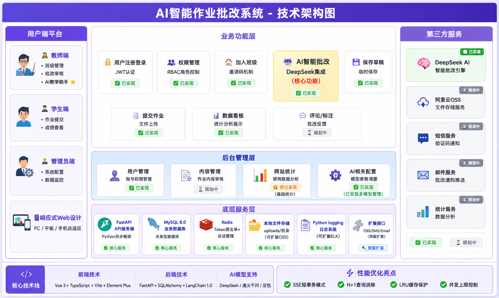

---

## 🌟 Star History

如果这个项目对你有帮助，欢迎给个 Star ⭐️
