# 多智能体平台架构与 Graph 维护手册

> 文档性质：当前实现与完整目标架构的唯一维护入口  
> 最后核对日期：2026-07-25  
> 适用项目：AI 智能作业批改系统  
> 技术基线：LangChain 1.3.14、LangGraph 1.2.9、Python 3.12

## 1. 如何使用这份文档

这份文档同时回答三个问题：

1. 当前生产代码中真正接通了哪些 Agent 和 Graph？
2. 完整多智能体平台最终需要包含哪些角色、工作流和安全边界？
3. 后续新增或修改 Agent 时，哪些代码、测试、Graph 和状态必须同步更新？

状态标记：

| 标记 | 含义 |
|---|---|
| ✅ | 已有生产实现并存在自动化测试 |
| 🟡 | 已有部分实现，但未达到本文件定义的完成条件 |
| ⬜ | 仅为目标设计，尚无生产实现 |
| ⛔ | 明确禁止的架构或数据流 |

维护原则：

- Graph 描述必须与生产代码一致，不能把测试替身或空目录标成已完成。
- 目标架构允许领先于代码，但必须使用 `⬜` 标识。
- 修改路由、Agent、工具、状态、事件或数据库模型时，必须在同一变更中更新本文件。
- 本文件描述架构真相；详细设计依据仍以 `specs/` 中的规格文档为准。
- 不在文档中记录 API Key、数据库密码、真实用户数据或 Prompt 密钥。

## 2. 当前结论

当前项目已经具备教师、学生、管理员三角色主管 Graph，以及批改、查重、
审批和持久化长任务工作流。三角色前端聊天、历史和管理员基础审批入口也已接通。
剩余工作集中在真实模型用量观测、完整 Step 生命周期、审批跨库崩溃窗口和
审批字段级 diff 体验。

| 范围 | 状态 | 当前结论 |
|---|---|---|
| 公共运行时与状态库 | ✅ | 模型网关、Prompt 注册、Run/Step/Artifact、SSE 和 PostgreSQL Checkpointer 已接通 |
| 教师只读查询 | ✅ | 寒暄、数据、策略、证据校验、审核、一次修订和安全降级已接通 |
| 教师批改与复核 | ✅ | 内容标准化、双 Agent 独立评分、10% 差异分流、版本幂等写回和 Celery 队列已接通 |
| 查重解释 Agent | ✅ | 确定性结果冻结，Agent 只解释风险与人工核查建议 |
| 写操作审批 | ✅ | ActionDraft、审批表、哈希、过期、行锁、权限复验和 MySQL 幂等执行账本已实现 |
| 学生助手 | ✅ | 主管、三类专业 Agent、本人数据工具、防代写和角色隔离会话已接通 |
| 管理员助手 | ✅ | 运营、审计、模型治理、最终审核和配置审批草案已接通 |
| 多角色前端 | ✅ | 共享面板按角色切换教学/学习/管理配置，管理员可审批，Markdown 经 DOMPurify 清理 |
| 离线评测与发布门禁 | 🟡 | 已有 100 条脱敏确定性基线及阈值测试；真实模型质量/成本回放门禁仍待接入 CI |

## 3. 目标架构总览

本节分为两个抽象层级：

- **L1 系统分层概览**：说明前端、API、Agent Runtime、角色主管、工具和存储之间的边界。
- **L2 完整目标 Agent 拓扑**：展开三种角色的主管、专业 Agent、审核、审批和长任务工作流。

第 5～7 节继续提供各角色及关键子工作流的 **L3 详细 Graph**。

### 3.1 L1：系统分层架构概览

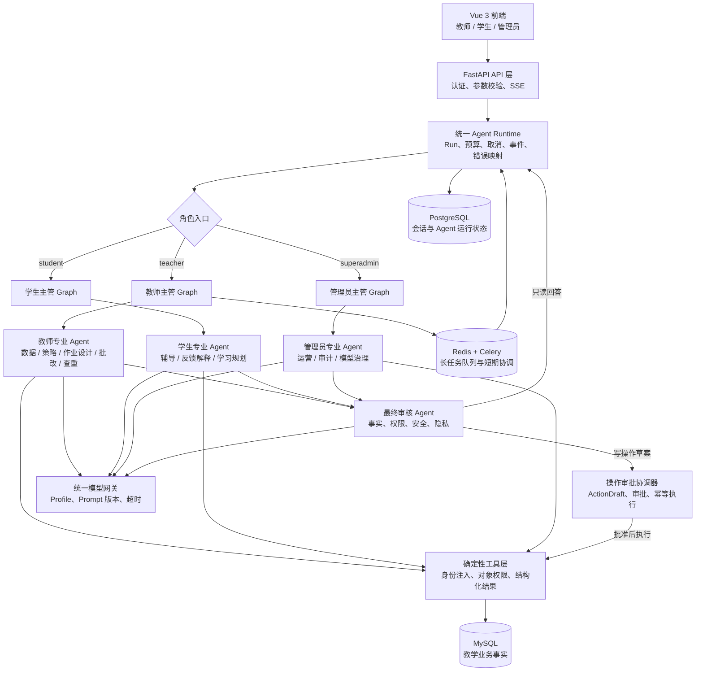

这张图只表达系统分层，不表示角色 Graph 内的全部节点。`TeacherAgents`、`StudentAgents`
和 `AdminAgents` 是专业 Agent 集合的折叠表示，完整展开关系见下一节。

### 3.2 L2：完整目标 Agent 拓扑

```mermaid
flowchart TB
    Runtime["统一 Agent Runtime<br/>Run / Budget / Cancel / SSE / Error"]
    RoleRouter{"认证角色入口"}

    Runtime --> RoleRouter

    subgraph TeacherGraph["教师主管 Graph"]
        TRoute{"教师意图与风险路由"}
        TCasual["普通对话节点<br/>寒暄 / 能力说明"]
        TData["教学数据 Agent"]
        TStrategy["教学策略 Agent"]
        TAssignment["作业设计 Agent"]
        TGradeEval["批改评价 Agent"]
        TGradeReview["批改复核 Agent"]
        TPlagiarism["查重分析 Agent"]
        TActionDraft["ActionDraft 节点"]
        TFinalReview["教师最终审核 Agent"]
        TSafeFallback["安全降级节点"]

        TRoute -->|普通对话| TCasual
        TRoute -->|数据查询| TData
        TRoute -->|教学策略| TStrategy
        TRoute -->|作业设计| TAssignment
        TRoute -->|受控写操作| TActionDraft

        TGradeEval --> TGradeReview
        TData --> TFinalReview
        TStrategy --> TFinalReview
        TAssignment --> TFinalReview
        TGradeReview --> TFinalReview
        TPlagiarism --> TFinalReview
    end

    subgraph StudentGraph["学生主管 Graph"]
        SRoute{"学生意图与风险路由"}
        SCasual["普通对话节点"]
        STutor["学习辅导 Agent"]
        SFeedback["反馈解释 Agent"]
        SPlanner["学习规划 Agent"]
        SAntiCheat["防代写拒绝节点"]
        SFinalReview["学生最终审核 Agent"]

        SRoute -->|普通对话| SCasual
        SRoute -->|概念与方法| STutor
        SRoute -->|成绩和评语| SFeedback
        SRoute -->|学习安排| SPlanner
        SRoute -->|进行中作业完整答案| SAntiCheat
        STutor --> SFinalReview
        SFeedback --> SFinalReview
        SPlanner --> SFinalReview
    end

    subgraph AdminGraph["管理员主管 Graph"]
        ARoute{"管理员意图与风险路由"}
        ACasual["普通对话节点"]
        AOps["运营分析 Agent"]
        AAudit["审计分析 Agent"]
        AGovernance["模型治理 Agent"]
        AConfigDraft["配置 ActionDraft"]
        AFinalReview["管理员最终审核 Agent"]

        ARoute -->|普通对话| ACasual
        ARoute -->|运营指标| AOps
        ARoute -->|审计异常| AAudit
        ARoute -->|模型质量与成本| AGovernance
        ARoute -->|配置修改| AConfigDraft
        AOps --> AFinalReview
        AAudit --> AFinalReview
        AGovernance --> AFinalReview
    end

    subgraph SharedRuntime["公共运行能力"]
        Approval["人工审批 Graph<br/>审批 / 载荷哈希 / 幂等执行"]
        ReadTools["结构化只读工具"]
        WriteTools["审批后写工具"]
        ModelGateway["统一模型网关"]
        LongTask["Redis + Celery 长任务 Graph"]
        PostgreSQL[("PostgreSQL<br/>会话 / Run / Step / Artifact")]
        MySQL[("MySQL<br/>教学业务事实")]
    end

    RoleRouter -->|teacher| TRoute
    RoleRouter -->|student| SRoute
    RoleRouter -->|superadmin| ARoute

    TCasual --> Runtime
    TFinalReview -->|只读回答通过| Runtime
    TFinalReview -->|写操作草案通过| TActionDraft
    TFinalReview -->|拒绝且无法修订| TSafeFallback
    TSafeFallback --> Runtime
    SCasual --> Runtime
    SAntiCheat --> Runtime
    SFinalReview --> Runtime
    ACasual --> Runtime
    AFinalReview --> Runtime

    TData --> ReadTools
    TStrategy --> ReadTools
    TAssignment --> ReadTools
    TRoute -->|批改长任务| LongTask
    TRoute -->|查重长任务| LongTask
    LongTask -->|grading| TGradeEval
    LongTask -->|plagiarism| TPlagiarism
    STutor --> ReadTools
    SFeedback --> ReadTools
    SPlanner --> ReadTools
    AOps --> ReadTools
    AAudit --> ReadTools
    AGovernance --> ReadTools

    TActionDraft --> Approval
    AConfigDraft --> Approval
    Approval --> WriteTools
    Approval --> Runtime

    ReadTools --> MySQL
    WriteTools --> MySQL
    LongTask --> MySQL
    LongTask --> PostgreSQL

    TData --> ModelGateway
    TStrategy --> ModelGateway
    TAssignment --> ModelGateway
    TGradeEval --> ModelGateway
    TGradeReview --> ModelGateway
    TPlagiarism --> ModelGateway
    TFinalReview --> ModelGateway
    STutor --> ModelGateway
    SFeedback --> ModelGateway
    SPlanner --> ModelGateway
    SFinalReview --> ModelGateway
    AOps --> ModelGateway
    AAudit --> ModelGateway
    AGovernance --> ModelGateway
    AFinalReview --> ModelGateway

    Runtime --> PostgreSQL
```

图中边界说明：

- 普通对话节点属于主管 Graph 的确定性节点，不属于专业 Agent。
- 教师批改由“批改评价 Agent → 批改复核 Agent”组成子工作流。
- 最终审核按角色独立配置策略，但复用公共审核契约和运行能力。
- `ActionDraft` 只生成草案；真正写入必须经过公共人工审批 Graph。
- 批改和查重等长任务进入 Redis/Celery；普通聊天查询保持请求内执行。
- 所有角色最终都通过统一 Runtime 保存 Run、Step、Artifact 和安全事件。

### 3.3 强制分层

| 层 | 职责 | 禁止事项 |
|---|---|---|
| API/Router | 认证、参数提取、SSE 封装 | 不放业务查询和 Agent 编排 |
| Service/Runtime | 创建 Run、执行 Graph、预算、取消、持久化 | 不信任客户端身份字段 |
| Supervisor/Graph | 意图路由、节点顺序、回退和降级 | 不直接操作 ORM |
| Subagent | 基于上下文和工具生成结构化候选结果 | 不直接访问数据库 |
| Reviewer | 审核事实、权限、安全和隐私 | 不持有业务工具 |
| Tool | 确定性数据访问和权限校验 | 不让模型传入 user_id/teacher_id |
| CRUD | 业务规则、查询、事务和幂等 | 不执行 LLM 推理 |
| Model Gateway | 模型配置、Profile、Prompt 版本和 HTTP 超时 | 不包含业务权限判断 |

### 3.4 Agent 代码目录

生产代码固定采用“领域根目录 + 主/子 Agent 分离”的结构：

```text
backend_python/app/agent/
├── contracts.py
├── runtime.py
├── checkpointer.py
├── gateway.py
├── registry.py
├── service.py
├── supervisors/          # 各角色主 Agent
├── subagents/            # 可独立测试和注册的专业 Subagent
├── graphs/               # LangGraph 节点、边、状态和子工作流
└── tools/                # 确定性查询与受控操作
```

约束：

- Supervisor 和 Subagent 必须分目录存放。
- 需要在 Graph 中观测的 Subagent 必须作为具名节点或子图接入，不能隐藏在 Tool 内。
- `app/agent/` 是 Agent 领域边界，因此不再增加一层重复的 `agents/`。
- 尚未实现的角色或工作流不创建无行为占位模块。

### 3.5 多角色前端接入

`frontend/src/layouts/AppLayout.vue` 是唯一挂载点，只对 `teacher`、`student` 和
`superadmin` 显示助手。前端角色只决定标题和可见视图，服务端身份仍只来自 JWT。

```text
frontend/src/components/
├── AssistantPanel.vue                         # 会话、SSE、取消和视图协调
└── assistant/
    ├── role-config.ts                         # 三角色展示配置
    ├── markdown.ts                            # marked + DOMPurify
    ├── AssistantChatView.vue                  # 聊天、阶段、停止生成
    ├── AssistantHistoryView.vue               # 角色隔离会话历史
    └── AssistantApprovalView.vue              # superadmin 待审批、批准、拒绝
```

约束：

- 未知角色不回退为教师助手。
- 学生端不渲染审批入口。
- 批准操作必须原样回传服务端返回的 `parameters`；哈希、过期和权限由后端复验。
- 审批参数只以文本 JSON 显示，不插入 HTML。
- 所有模型 Markdown 输出经过 DOMPurify 后才进入 `v-html`。
- 角色切换会取消当前 Run，并清空会话、消息和审批视图状态。

## 4. 当前教师只读 Graph

生产入口：

- API：`POST /api/assistant/runs/stream`
- Graph：`backend_python/app/agent/graphs/teacher.py`
- 服务：`backend_python/app/agent/service.py`
- Agent 注册：`backend_python/app/agent/registry.py`

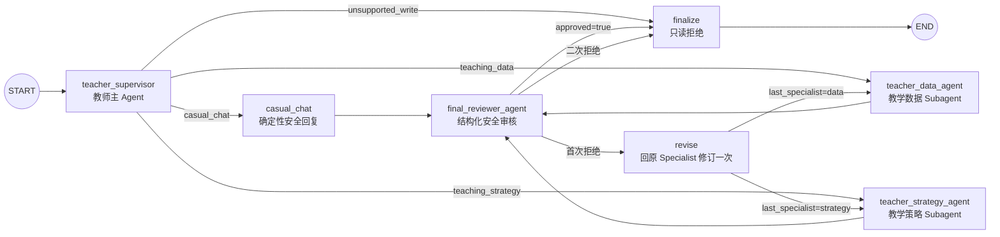

### 4.1 当前节点职责

| 节点 | 状态 | 输入 | 输出 |
|---|---|---|---|
| `teacher_supervisor` | ✅ | `user_message` | `IntentDecision`、`last_specialist` |
| `casual_chat` | ✅ | 普通寒暄或能力说明 | 无需业务证据的安全回复 |
| `teacher_data_agent` | ✅ | 用户消息、摘要、近期消息、教师上下文 | `SpecialistResponse` |
| `teacher_strategy_agent` | ✅ | 用户消息、摘要、近期消息、教师上下文 | `SpecialistResponse` |
| `final_reviewer_agent` | ✅ | 候选回答、意图、证据引用 | `ReviewResult` |
| `revise` | ✅ | 审核问题、原候选结果 | 修订次数和回退路由 |
| `finalize` | ✅ | 意图、审核结果、候选回答 | 安全最终回答 |

### 4.2 已修复：普通寒暄路由

教师入口当前支持四类意图：

- `casual_chat`
- `teaching_data`
- `teaching_strategy`
- `unsupported_write`

“你好”“谢谢”“你是谁”等独立寒暄进入 `casual_chat`，不会调用教学数据或教学策略 Subagent：

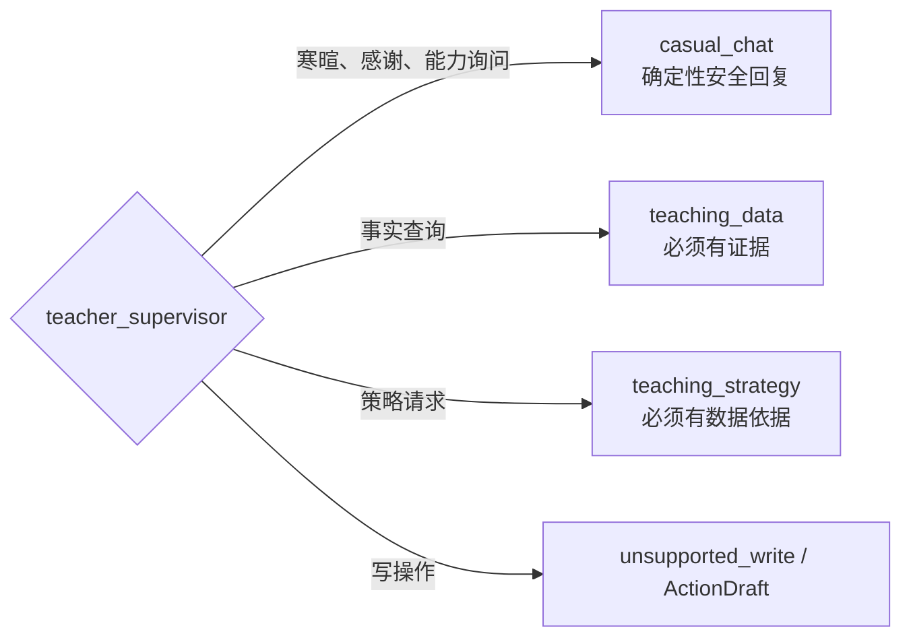

不能通过“取消所有回答的证据检查”解决寒暄问题。正确边界是：

- `casual_chat` 不要求业务数据证据。
- `teaching_data` 和 `teaching_strategy` 继续强制证据。
- 路由决定回答是否属于事实性业务回答，Reviewer 根据意图执行相应策略。

## 5. 完整目标角色与 Agent

### 5.1 教师主管

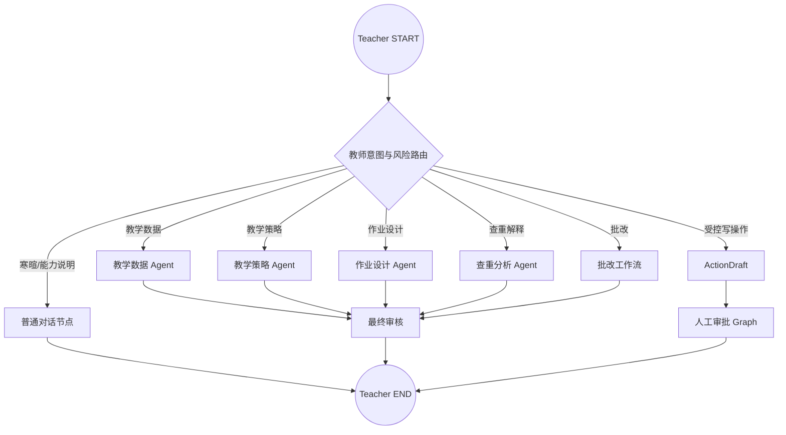

| Agent/工作流 | 状态 | 目标职责 |
|---|---|---|
| 教师主管 | 🟡 | 聊天覆盖数据、策略和安全拒绝；批改/查重以独立长任务 Graph 接入 |
| 普通对话节点 | ✅ | 寒暄、能力说明、帮助提示 |
| 教学数据 Agent | ✅ | 班级、学生、作业、提交、看板、待批改查询 |
| 教学策略 Agent | ✅ | 基于工具数据生成教学建议 |
| 作业设计 Agent | 🟡 | 通用 ActionDraft/审批能力已存在，独立作业设计 Prompt 尚未接入教师聊天图 |
| 批改评价 Agent | ✅ | 按结构化量表生成候选评分 |
| 批改复核 Agent | ✅ | 独立复核评分和评语 |
| 查重分析 Agent | ✅ | 解释确定性查重结果，不重新计算数值 |
| 最终审核 Agent | ✅ | 按证据、权限、安全与隐私 fail closed |

### 5.2 学生主管

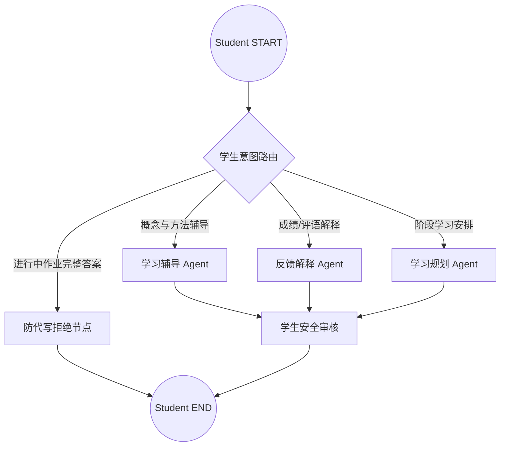

学生端强制规则：

- 只能读取本人提交、成绩和反馈。
- 不允许读取同学数据或教师内部批改信息。
- 对进行中作业提供思路、提示和分步辅导，不生成可直接提交的完整答案。
- 学生会话摘要不能与教师会话复用。

### 5.3 管理员主管

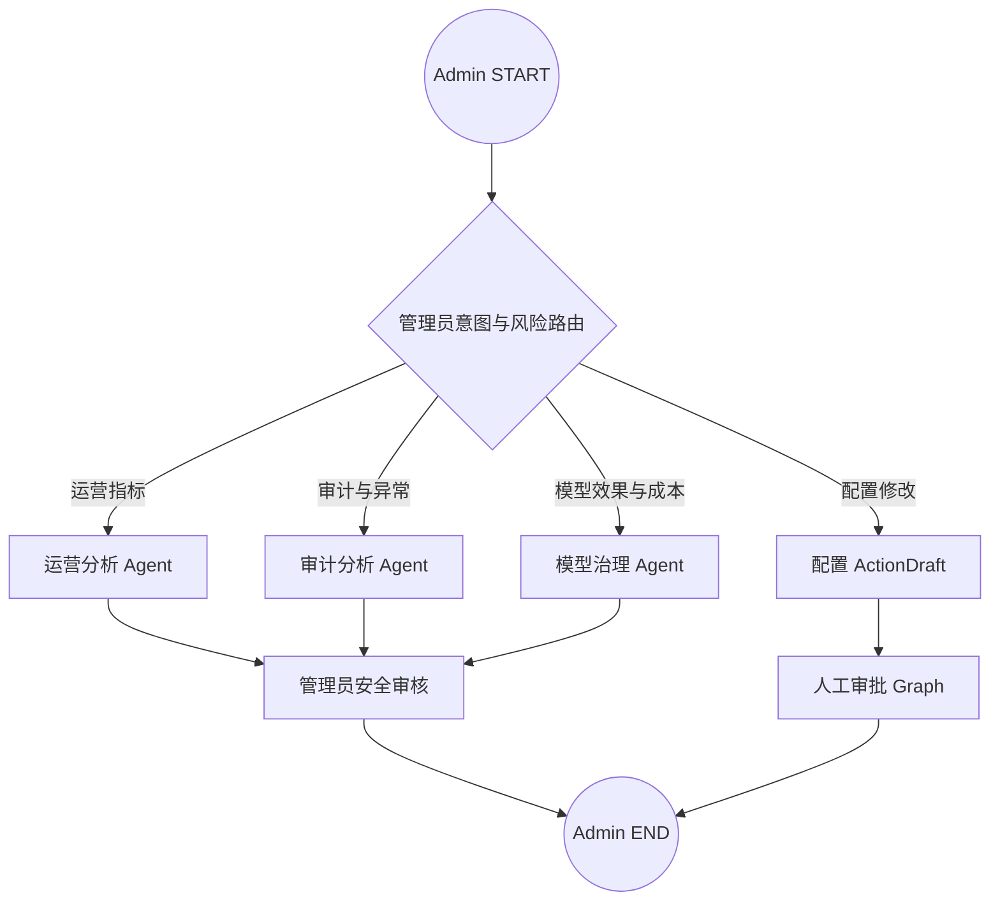

管理员端强制规则：

- 默认只读取聚合运营数据和脱敏运行元数据。
- 聊天正文、作业正文、API Key、Access Key、Secret Key 不进入模型上下文。
- 模型配置修改只能产生 ActionDraft，不能由 Agent 直接执行。

## 6. 当前批改与查重 Graph

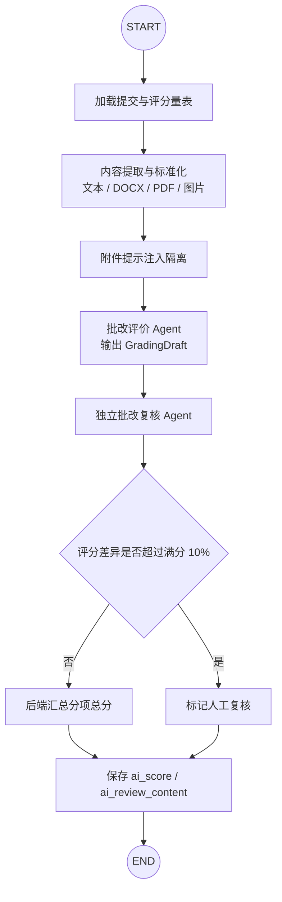

批改约束：

- 总分由后端汇总分项，不能用正则从模型自然语言中提取。
- AI 只能写 `ai_score` 和 `ai_review_content`。
- AI 不得覆盖 `teacher_score` 和教师评语。
- 重复提交或任务重试必须使用版本化幂等键。

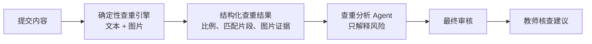

查重约束：

- 所有比例和匹配结果必须逐字段来自 `run_full_check()`。
- Agent 不重新计算重复率。
- Agent 不直接认定抄袭或违纪，只提供风险解释和人工核查建议。

## 7. 当前写操作审批 Graph

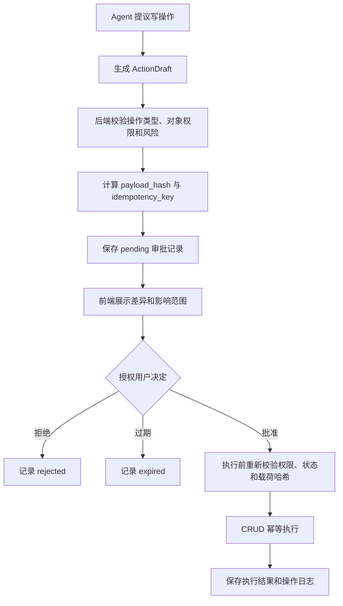

任何 Agent 写操作都必须满足：

1. 有版本化 `ActionDraft`。
2. 审批人与目标对象权限匹配。
3. 审批未过期。
4. 执行载荷与审批载荷哈希一致。
5. 幂等键未被成功执行过。
6. CRUD 在执行时再次进行权限校验。

## 8. 当前运行时序

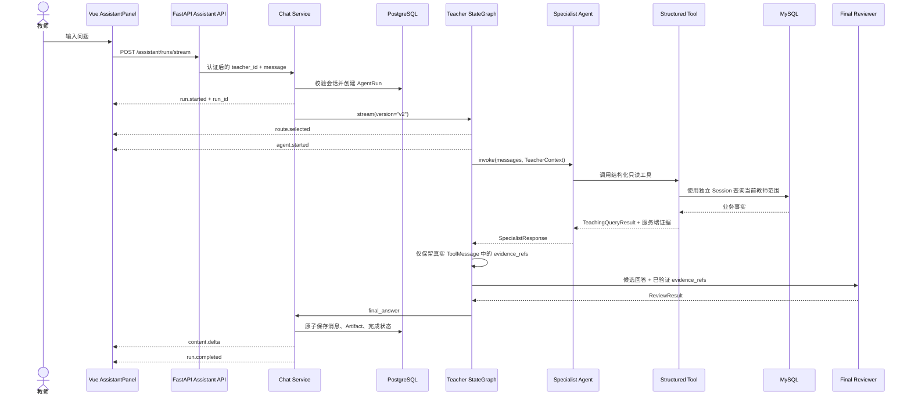

## 9. 状态、契约和持久化

### 9.1 服务端身份

```text
ActorContext
├── user_id
├── role
├── request_id
└── session_id
```

身份必须来自认证依赖。禁止把以下字段暴露为 LLM 工具参数：

- `user_id`
- `teacher_id`
- `student_id`
- `role`
- 数据库 Session

工具通过 `ToolRuntime[TeacherContext]` 获取服务端注入身份。

### 9.2 关键结构化契约

| 契约 | 用途 | 状态 |
|---|---|---|
| `IntentDecision` | 意图、风险、目标 Agent、原因 | ✅ |
| `SpecialistResponse` | 候选回答、证据引用、限制 | ✅ |
| `TeachingQueryResult` | 工具状态、指标、记录、证据、限制 | ✅ |
| `ReviewResult` | 审核结果、问题、修订回答 | ✅ |
| `AnalysisArtifact` | 版本化分析结果 | ✅ |
| `UsageSummary` | 模型、Profile、Token、延迟 | 🟡 |
| `GradingRubric` / `GradingDraft` / `GradingOutcome` | 量表、双评分和差异决策 | ✅ |
| `PlagiarismExplanation` / `PlagiarismAnalysis` | 数值冻结后的解释 | ✅ |
| `StudentIntentDecision` / `AdminIntentDecision` | 角色主管路由 | ✅ |
| `ModelConfigProposal` / `ModelGovernanceResponse` | 非敏感模型治理提案 | ✅ |
| `ActionDraft` | 受控写操作草案 | ✅ |

### 9.3 PostgreSQL 状态表

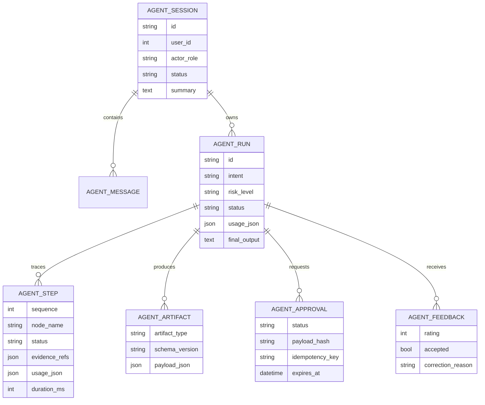

当前已实现：

- `agent_sessions`
- `agent_messages`
- `agent_runs`
- `agent_steps`
- `agent_artifacts`
- `agent_approvals`
- MySQL `agent_action_executions` 幂等执行账本
- LangGraph PostgreSQL Checkpointer 表（由官方 `PostgresSaver.setup()` 管理）

角色 Graph 使用 `run.id` 作为 LangGraph `thread_id`，并通过
`langgraph-checkpoint-postgres 3.1.0` 保存节点检查点。业务 Run/Step/Artifact
仍作为面向产品的审计模型，不能用 Checkpointer 表替代。

目标待实现：

- `agent_feedback`
- 面向审批中断的显式 resume API 与前端恢复体验

## 10. SSE 事件协议

| 事件 | 含义 | 前端行为 |
|---|---|---|
| `run.started` | Run 已持久化 | 保存 `run_id` |
| `route.selected` | 已完成意图路由 | 显示安全的中文阶段名 |
| `agent.started` | Specialist/Reviewer 开始 | 更新处理阶段 |
| `agent.completed` | Agent 完成 | 不展示内部输出 |
| `content.delta` | 审核后的安全文本增量 | 累计显示回答 |
| `run.completed` | 消息与 Run 已提交 | 拉取最终会话消息 |
| `run.failed` | 运行失败 | 显示稳定错误提示 |
| `run.cancelled` | 运行已取消 | 停止生成并保留安全内容 |
| `heartbeat` | 长连接保活 | 重置前端超时 |

安全要求：

- 任何事件必须包含真实 `run_id`。
- 未审核的候选回答、ToolMessage、工具参数和异常堆栈不得进入 SSE。
- `run.completed` 只能在最终消息和 Run 状态提交成功后发送。

## 11. 预算、取消和错误

当前默认预算：

```text
max_nodes      = 8
max_tool_calls = 12
timeout        = 45 seconds
```

稳定错误码：

| 错误码 | 含义 |
|---|---|
| `AGENT_CHAT_ERROR` | 未分类的安全兜底错误 |
| `AGENT_MODEL_TIMEOUT` | 单次模型请求超时 |
| `AGENT_BUDGET_EXCEEDED` | 节点、工具或总时间预算超限 |
| `AGENT_RUN_CANCELLED` | 用户或系统取消运行 |

目标生产约束：

- 模型 HTTP 超时不得超过 Run 剩余预算。
- 取消与完成必须使用数据库条件更新，不能依赖“先查状态再提交”。
- 已取消 Run 不得写最终助手消息。
- 客户端断开后，服务端应尽力取消仍在运行的 Run。
- 长任务必须支持幂等重试和版本保护。

## 12. 工具清单

当前结构化工具：

| 工具 | 参数 | 权限范围 |
|---|---|---|
| `get_my_classes` | 无 | 当前教师班级 |
| `get_my_class_students` | `class_id` | 必须属于当前教师 |
| `get_my_assignments` | 无 | 当前教师作业 |
| `get_my_assignment_summary` | `assignment_id` | 必须属于当前教师 |
| `get_my_student` | 姓名或学号 | 当前教师班级内学生 |
| `get_my_dashboard` | 无 | 当前教师聚合看板 |
| `get_my_pending_reviews` | 无 | 当前教师待批改提交 |
| 学生本人学习概览工具 | 无 | 当前学生本人 |
| 学生本人反馈工具 | 作业筛选 | 当前学生本人 |
| `get_platform_operations` | 无 | 管理员脱敏聚合数据 |
| `get_agent_runtime_metrics` | 无 | 管理员脱敏 Run 聚合 |
| `get_model_governance_metrics` | 无 | 不含密钥的模型元数据与用量 |

工具完成条件：

- 返回 Pydantic 可验证的结构化结果。
- 包含可追踪的 `evidence_refs`。
- 错误时返回稳定、安全、结构化的失败结果。
- 每次调用使用独立数据库 Session。
- 对象权限在查询条件中强制执行。

## 13. 安全审核策略

审核至少覆盖：

- 敏感信息泄露
- 跨教师、跨学生或跨角色数据泄露
- 无工具证据的事实性陈述
- 内部数据库 ID、工具参数、Prompt 或异常堆栈
- 未经审批的写操作暗示
- 学生进行中作业的完整代写答案
- 管理员读取聊天或作业正文

证据策略按意图区分：

| 意图 | 是否要求业务证据 |
|---|---|
| 普通寒暄、能力说明 | 否 |
| 教学数据查询 | 是 |
| 教学策略 | 是 |
| 批改结果 | 是 |
| 查重解释 | 是 |
| 学生反馈解释 | 是 |
| 写操作草案 | 要求目标对象和权限证据 |

## 14. 当前已知架构缺口

| 优先级 | 缺口 | 影响 | 目标处理 |
|---|---|---|---|
| P1 | PostgreSQL 审批与 MySQL 业务事务不能做单库原子提交 | 崩溃后审批可能停在 failed，但 MySQL 幂等账本会阻止重复写 | 增加执行账本人工对账/恢复命令，后续可演进为 outbox |
| P1 | 作业设计专业 Agent 尚未接入教师聊天主管 | 教师只能通过通用草案 API 创建草案 | 增加 assignment_design Subagent 和路由 |
| P1 | 模型超时未按剩余预算收紧 | 单次调用可能超过 Run 总预算 | 动态设置模型请求超时 |
| P1 | Step 缺少完整 running/cancelled 生命周期 | 运行追踪不完整 | 节点边界更新 Step 状态 |
| P1 | 生产路径未记录真实 Token 用量 | 成本不可观测 | 从模型元数据汇总 usage |
| P1 | 100 条评测集当前为确定性脱敏基线 | 尚不能衡量线上模型回答质量漂移 | 增加录制模型回放和 CI 成本预算 |
| P1 | 审批前端缺少结构化 diff 预览 | 用户不易核对具体变更 | 增加审批卡片、变更字段 diff 和历史页 |
| P2 | 内容增量在审核完成后统一切片 | 首内容等待时间较长 | 保持安全前提下优化审核后输出 |
| P2 | 文档状态与计划复选框曾不同步 | 容易误判完成度 | 以本文件状态矩阵为入口同步维护 |

## 15. 测试与发布门槛

### 15.1 当前测试域

- 状态和 Pydantic 契约测试
- 规则路由测试
- Specialist Registry 测试
- 结构化工具与权限测试
- Graph 回退、预算和取消测试
- Run/Step/Artifact CRUD 集成测试
- Assistant API 与 SSE 测试
- 前端 SSE 解析、增量、取消、会话、三角色配置、Markdown 清理和审批视图测试
- 批改/复核、查重冻结、Celery 幂等和旧版本写回测试
- ActionDraft 审批、篡改、过期、错误审批人和重复执行测试
- 学生/管理员角色边界与 Subagent 测试
- 100 条脱敏离线评测基线

### 15.2 完整目标门槛

| 指标 | 最低要求 |
|---|---|
| 路由准确率 | ≥ 95% |
| 结构化输出有效率 | ≥ 99% |
| 数据回答关键事实准确率 | ≥ 98% |
| 权限泄露用例 | 0 |
| 未审批写操作 | 0 |
| 查重数值偏差 | 0 |
| 幂等重复执行 | 0 |

离线评测集至少包含：

- 路由 30 条
- 教学数据 25 条
- 批改 20 条
- 查重 10 条
- 学生助手 10 条
- 管理员助手 5 条

### 15.3 2026-07-25 实际验证

| 验证 | 结果 |
|---|---|
| 多 Agent/安全加固专项 | 86 passed |
| 后端全量 | 298 passed |
| 前端 Vitest | 61 passed |
| `vue-tsc --noEmit` | 通过，零错误 |
| Vite 生产构建 | 3297 modules transformed，仓库内隔离输出目录构建通过 |
| `docker compose --env-file .env.docker config --quiet` | 通过；数据库与 Redis host 端口仅绑定 `127.0.0.1` |
| 浏览器三角色真实登录 | 未执行：本轮前后端未运行，浏览器宿主还受到 AppData ACL 限制 |

自动化测试和构建结果不能替代真实账号联调。服务与测试账号就绪后，仍需分别验证
student、superadmin 和 teacher 的聊天、历史、取消及管理员审批流程。

## 16. 新增或修改 Agent 的标准流程

### 16.1 新增 Agent

1. 在 `contracts.py` 定义版本化输入/输出契约。
2. 在 `registry.py` 注册独立 Prompt 名称、版本、Model Profile、工具白名单和 `response_format`。
3. 主 Agent 放入 `supervisors/`，专业子 Agent 放入 `subagents/`。
4. 在 `graphs/state.py` 增加必要状态字段。
5. 在 `graphs/` 对应角色或工作流中接入具名节点、条件边和失败路径。
6. 明确该意图是否要求证据、审核和审批。
7. 增加预算、取消、权限、结构化输出和失败关闭测试。
8. 增加 SSE 阶段映射和前端测试。
9. 更新本文件的 Graph、状态矩阵、工具表和变更记录。

### 16.2 修改 Graph

修改前必须回答：

- 新节点由哪个意图进入？
- 最大执行次数是多少？
- 是否可能形成无限循环？
- 在哪个节点消费预算？
- 取消检查在哪里执行？
- 节点失败后是重试、降级还是终止？
- 哪些输出可以进入前端？
- 哪些 Artifact 需要持久化？

Graph 修改完成后必须验证：

- 正常路径
- 每个条件分支
- 首次拒绝与二次拒绝
- 节点预算耗尽
- 工具预算耗尽
- 模型超时
- 用户取消
- 跨用户和跨角色访问

### 16.3 修改工具

- 不得新增由模型填写的身份字段。
- 参数必须能够生成公开 `tool_call_schema`。
- `ToolRuntime` 上下文必须能在运行时被 Pydantic 解析。
- 新查询必须在 CRUD/Query 层校验对象归属。
- 返回结果必须包含状态、证据和限制。

### 16.4 修改审核策略

- 先区分事实性和非事实性意图。
- 不得为了支持寒暄而取消数据回答的证据要求。
- 新的允许规则必须配套至少一个拒绝测试。
- 审核结构化结果缺失或非法时必须 fail closed。

## 17. 文档同步检查表

每次 Agent 相关 PR 或提交都应检查：

- [ ] 状态矩阵是否更新？
- [ ] 当前 Graph 是否与生产代码一致？
- [ ] 目标 Graph 是否发生变化？
- [ ] Agent/工具清单是否更新？
- [ ] 新增契约是否记录？
- [ ] SSE 事件是否变化？
- [ ] 权限与证据规则是否变化？
- [ ] 数据库表或 Artifact 是否变化？
- [ ] 已知缺口是否解决或新增？
- [ ] 测试和发布门槛是否更新？
- [ ] 变更记录是否追加？

## 18. 变更记录

| 日期 | 变更 | 影响范围 | 验证 |
|---|---|---|---|
| 2026-07-25 | 建立完整目标架构与当前实现维护手册 | 全部 Agent 架构 | 对照当前代码与 `docs/superpowers` 规格 |
| 2026-07-25 | 将目标架构拆分为 L1 分层概览、L2 完整拓扑和 L3 角色 Graph | 架构图层级 | 核对主管、专业 Agent、审核、审批和长任务路径 |
| 2026-07-25 | 记录普通寒暄被错误路由的问题 | 教师主管、Reviewer | 截图复现：“你好啊”进入安全降级 |
| 2026-07-25 | 修复 `RunBudget` 前向引用导致工具 Schema 崩溃 | 结构化工具运行时 | Agent 测试 166/166 通过 |
| 2026-07-25 | 主/子 Agent 分目录，Graph 使用具名 Agent 节点，并修复 `casual_chat` | Agent 包、教师 Graph、Reviewer | Agent 测试 182/182 通过 |
| 2026-07-25 | 统一 Graph/SSE/Step 节点名，传递 Reviewer 修订问题，校验真实 Tool 证据 | 教师 Graph、Subagent、运行审计 | 包含于 Agent 测试 182/182 |
| 2026-07-25 | 接入双 Agent 批改、查重解释、Redis/Celery 与版本幂等写回 | 批改/查重 Graph、长任务 | 阶段 2 专项测试通过 |
| 2026-07-25 | 实现 ActionDraft、人工审批、哈希防篡改和白名单执行 | 审批 Graph、API、PostgreSQL | 审批专项测试通过 |
| 2026-07-25 | 实现学生与管理员主管、七个专业/审核 Subagent 及角色工具 | 三角色 Agent 平台 | 角色专项测试通过 |
| 2026-07-25 | 接入 PostgreSQL Checkpointer 3.1.0 与 100 条脱敏离线评测 | LangGraph 持久化、发布基线 | Checkpointer 与评测测试通过 |
| 2026-07-25 | 修复审批并发/跨库重复执行、批改重复领取和提交班级越权 | 审批账本、Celery、Submission 权限 | 后端全套测试通过 |
| 2026-07-25 | 接入学生/管理员共享前端面板、管理员审批视图和安全 Markdown，并清零前端类型错误 | Vue 助手、审批 API、三角色入口 | 前端测试、`vue-tsc`、Vite 构建通过；真实登录联调未执行 |
| 2026-07-25 | 修复三角色流式与取消生命周期：学生/管理员即时发出 `run.started`、持续心跳和节点边界协作取消；面板隐藏/卸载/延迟会话创建双重取消；失败终态互斥并支持 CRLF SSE | Agent Runtime、共享助手 SSE 客户端 | 后端 263/263、前端 61/61 通过 |
| 2026-07-25 | 完成生产加固：容器双迁移与独立 Worker、批改 processing 重投递、64 位 Run ID、审批竞态和对象权限、角色预算、多模态图片、SSE EOF 失败关闭及并发容量保护 | Docker、Grading、Approval、Agent Runtime、Vue SSE | 后端 298/298、前端 61/61、类型检查、生产构建、Compose 和双 Alembic head 通过 |

新增记录模板：

```text
| YYYY-MM-DD | 变更摘要 | Agent / Graph / Tool / Contract / API | 测试命令与结果 |
```

## 19. 相关文档

- `docs/superpowers/specs/2026-07-24-multi-agent-platform-design.md`
- `docs/superpowers/specs/2026-07-25-multi-agent-phase1-5-runtime-hardening-design.md`
- `docs/superpowers/specs/2026-07-25-multi-role-assistant-frontend-design.md`

（历史实施计划已于 2026-07-26 清理，执行历史见 git 提交记录。）
