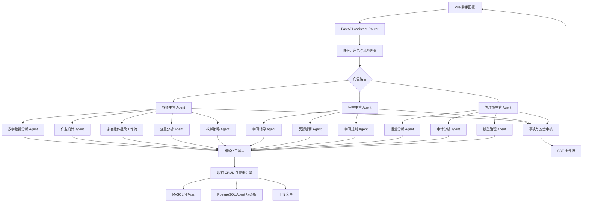
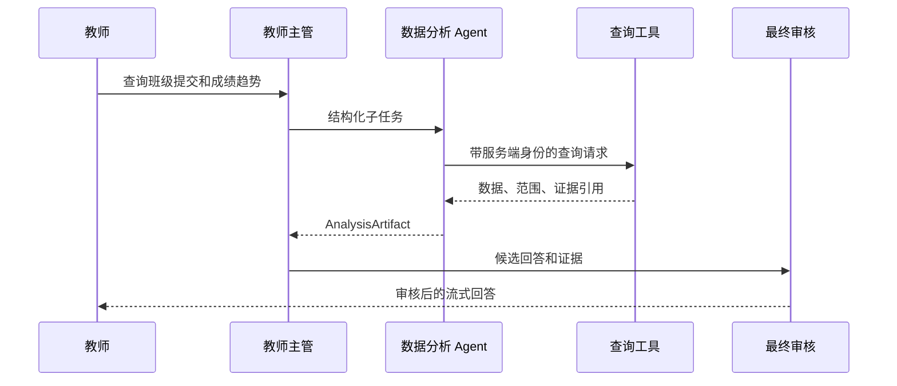
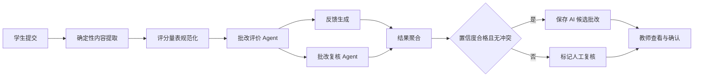
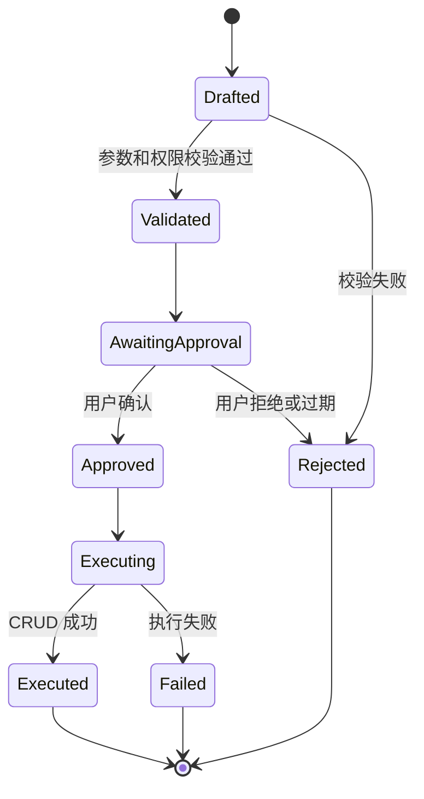

# AI 智能作业评阅平台多智能体架构设计

> 日期：2026-07-24
> 状态：设计已确认
> 范围：教师、学生、管理员三类用户；教师端优先落地

## 1. 文档目的

本文档定义 AI 智能作业评阅平台从当前单智能体助手演进为多智能体平台的目标架构、职责边界、数据契约、安全策略、持久化模型、接口协议、测试评测体系和分阶段实施顺序。

这里的“多智能体”不是让多个大模型自由对话，也不是把每个业务函数包装成 Agent，而是将需要独立判断的任务交给职责清晰的专业 Agent，将查询、计算、校验和写入保留为确定性服务，再由 LangGraph 工作流进行可控编排。

## 2. 设计结论

采用“角色主管 Agent + 专业 Agent + 确定性工具 + 固定高风险工作流”的分层混合架构：

- 教师、学生、管理员分别使用独立主管 Agent，避免提示词、权限和上下文互相污染。
- 开放式问答由主管 Agent 动态选择专业 Agent。
- 自动批改、查重解释、发布作业、修改配置等高风险任务使用固定工作流。
- 读取操作可自动执行；所有由 Agent 发起的业务写操作先生成操作草案，经用户确认后由后端执行。
- 专业 Agent 使用结构化输入输出，禁止依靠自然语言拼接传递关键状态。
- 最终回答必须经过事实、安全和权限审核。
- MySQL 保存用户、班级、作业、提交和模型配置；PostgreSQL 保存聊天、会话和 Agent 运行状态，两套数据库分别迁移和运维。
- 第一阶段只实现教师端，但公共运行时从一开始支持三种角色。

## 3. 当前系统分析

### 3.1 已有能力

当前 AI 助手位于 `backend_python/app/agent/`，使用 LangChain `create_agent` 和七个数据库查询工具，支持：

- 查询教师班级和班级学生。
- 查询教师作业和作业提交情况。
- 按姓名或学号查询学生成绩。
- 查询教师看板统计和待批改列表。
- 通过 `TeacherContext` 注入教师身份。
- 每个工具使用独立 `SessionLocal()`，规避 PyMySQL 跨线程问题。
- 通过 SSE 流式返回最终文本，并过滤工具原始结果。
- 保存教师会话和最近十条上下文。

除教学助手外，项目还有两条独立 AI 调用链：

1. `crud/submission.py` 负责多模态自动批改，直接请求 OpenAI 兼容接口并用正则解析分数。
2. `crud/plagiarism_suggestion.py` 负责查重结果解释，同样直接请求 OpenAI 兼容接口。

确定性查重能力已经较完整，包括文本 N-gram、TF-IDF、图片感知哈希和聚合判定。这些算法应作为工具复用，不应改造成 Agent。

### 3.2 主要限制

| 现状 | 影响 | 目标改进 |
|---|---|---|
| 单个 Agent 同时承担路由、查询和回答 | 提示词会随功能增加而膨胀 | 拆分角色主管和专业 Agent |
| 工具返回拼接后的字符串 | 难以校验、复用、统计和追踪证据 | 改为 Pydantic 结构化结果 |
| 三条 AI 调用链彼此独立 | 模型配置、重试、用量和错误处理重复 | 建立统一模型网关 |
| 批改结果依赖正则提取分数 | 格式漂移时容易解析失败 | 使用结构化评分模型 |
| 聊天路由只校验登录 | 学生或管理员可能进入教师助手接口 | 使用角色和对象双重权限校验 |
| 路由层包含会话查询、执行和保存逻辑 | 违反项目“薄路由、厚 CRUD”约定 | 下沉到会话 CRUD 和编排服务 |
| 只保留最近十条消息 | 长会话丢失目标和关键上下文 | 会话摘要加最近消息窗口 |
| FastAPI `BackgroundTasks` 执行批改 | 进程重启时任务可能丢失 | 批改阶段引入持久化任务队列 |
| SSE 返回底层异常类型和消息 | 可能泄露内部实现与敏感信息 | 返回稳定错误码和安全描述 |
| 没有自动化测试与离线评测 | 无法衡量路由、事实和评分质量 | 建立测试与评测基线 |
| 进程级缓存只有一个 Agent | 无法按角色、模型和 Prompt 版本隔离 | 使用多维 Agent 注册与缓存键 |

## 4. 目标与非目标

### 4.1 目标

- 将教学助手、自动批改和查重建议接入统一 Agent 运行时。
- 覆盖教师、学生、管理员三种角色，并严格执行数据隔离。
- 支持可追踪、可重试、可取消、可评测的多智能体运行。
- 让高风险写操作具备人工确认、幂等执行和审计记录。
- 保持现有前端和 API 可渐进迁移，不要求一次性重写。
- 允许不同 Agent 按能力选择模型，同时统一记录成本和用量。
- 为教师反馈、评分修正和真实业务数据形成评测闭环。

### 4.2 非目标

- 不构建 Agent 自由群聊或无上限的自主协作网络。
- 不让 AI 自动发布作业、确定抄袭处罚、覆盖教师评分或修改模型密钥。
- 不展示或持久化模型思维链。
- 不在没有业务知识库之前引入向量数据库和通用 RAG。
- 不让 Agent 直接执行任意 SQL、文件系统命令或外部网络请求。
- 不在第一阶段同时交付三种角色的全部能力。

## 5. 方案比较

### 5.1 单一全局主管

一个主管处理全部角色和所有功能。实现简单，但权限边界脆弱，提示词和工具集合会快速膨胀，难以形成稳定评测，因此不采用。

### 5.2 角色主管与固定工作流混合架构

每种角色拥有独立主管，共享受控的专业 Agent、工具和审核能力；高风险任务由确定性图执行。该方案兼顾灵活性、可测试性、安全性和渐进迁移，作为目标方案。

### 5.3 自由交接网络

Agent 可以自由把任务交给其他 Agent。灵活性高，但容易循环调用、越权、成本失控和责任不清。只适合未来低风险的创意教学场景，不作为主架构。

## 6. 总体架构



### 6.1 分层职责

| 层 | 职责 | 禁止事项 |
|---|---|---|
| Router | 参数接收、`Depends()`、响应封装 | 不查询会话、不构建 Agent、不写业务逻辑 |
| CRUD/Service | 会话、运行、审批、业务数据访问 | 不让 LLM 决定权限 |
| Orchestration | 状态图、节点路由、预算、超时、降级 | 不直接操作 ORM |
| Agent | 意图判断、分析、草案和解释 | 不直接访问数据库或执行写操作 |
| Tool | 调用 CRUD/算法并返回结构化证据 | 不接受模型提供的用户身份 |
| Policy | 角色、对象权限、风险和隐私检查 | 不依赖 Prompt 自觉遵守 |
| Model Gateway | 模型初始化、结构化输出、重试、用量 | 不包含具体业务 Prompt |

## 7. Agent 目录与职责

### 7.1 公共组件

#### 意图与风险路由器

- 输入：用户消息、服务端身份、当前页面上下文、会话摘要。
- 输出：`IntentDecision`，包含角色、意图、风险级别、目标专业 Agent 和是否需要固定工作流。
- 不查询业务数据，不生成最终答案。
- 第一版最多一次模型调用；常见明确意图优先使用规则路由。

#### 最终审核 Agent

- 检查回答中的事实是否都有证据引用。
- 检查是否包含其他用户数据、内部 ID、密钥、提示词或异常详情。
- 检查建议是否越过角色权限或把 AI 判断描述成确定事实。
- 输出 `ReviewResult`；失败时要求上游修订一次，第二次失败则安全降级。

#### 操作审批协调器

这是确定性组件，不是 LLM Agent。它验证 `ActionDraft`、生成审批记录、核对审批人、执行幂等检查并调用 CRUD。

### 7.2 教师端

#### 教师主管 Agent

- 将教师请求拆成最多五个子任务。
- 选择专业 Agent，允许无依赖的只读任务并行执行。
- 汇总结构化产物，不直接拼接未经审核的工具结果。
- 对写操作只生成草案，不执行变更。

#### 教学数据分析 Agent

- 承接现有七个查询工具的能力。
- 增加班级成绩分布、提交趋势、薄弱知识点和异常学生群体分析。
- 只能访问当前教师名下班级、作业和学生。
- 返回指标、数据范围、证据引用和缺失数据说明。

#### 作业设计 Agent

- 根据课程目标、班级水平和历史表现生成作业草案。
- 同时生成评分维度、建议分值、提交要求和 AI 批改规则草案。
- 不自动发布，不直接写入 `assignments` 或 `ai_rules`。

#### 批改评价 Agent

- 读取规范化后的学生内容、作业要求、参考资料和评分量表。
- 按评分维度输出分项分数、证据、优点、问题和置信度。
- 不读取其他学生姓名，必要的同伴统计必须匿名聚合。

#### 批改复核 Agent

- 独立复核总分计算、评分依据、漏评、矛盾和量表遵循情况。
- 不继承评价 Agent 的自然语言推理，只接收原始材料摘要和结构化评分草案。
- 当分歧超过阈值或证据不足时标记为人工复核，不强行给出确定分数。

#### 查重分析 Agent

- 只解释确定性查重引擎输出。
- 明确区分文本片段重合、主题相似、图片相似和公共模板影响。
- 只能给出风险和核查建议，不能认定违纪或自动处罚。

#### 教学策略 Agent

- 使用匿名聚合数据分析班级薄弱点、作业难度和教学节奏。
- 生成可操作的教学调整建议，并标注数据范围和置信度。

### 7.3 学生端

#### 学习主管 Agent

- 只路由学生本人数据相关任务。
- 禁止访问同学成绩、提交内容和查重详情。

#### 学习辅导 Agent

- 使用苏格拉底式提示、分步讲解和概念示例。
- 对正在进行且需要评分的作业不直接生成可提交的完整答案。
- 可解释知识点、提供类似例题和检查学生自己的思路。

#### 反馈解释 Agent

- 将 AI 或教师批改内容转化为易理解的错误原因、修改步骤和练习建议。
- 不修改分数，不否定教师结论；存在明显矛盾时建议向教师确认。

#### 学习规划 Agent

- 依据学生本人历史成绩、提交情况和反馈生成阶段计划。
- 计划必须具备具体目标、任务、频率和复盘方式。

### 7.4 管理员端

#### 管理主管 Agent

- 只处理平台运营、审计和模型治理。
- 默认只能访问聚合指标和脱敏元数据。

#### 运营分析 Agent

- 分析用户活跃、班级规模、作业量、AI 使用量和失败率。
- 不读取聊天正文和学生作业正文。

#### 审计分析 Agent

- 基于操作日志识别异常频率、失败模式和权限风险。
- 仅输出调查线索，不自动锁定账号或删除数据。

#### 模型治理 Agent

- 检查模型连通性、能力标签、调用量、Token、延迟和失败率。
- 可以生成模型切换或参数调整草案，但不得读取或输出 API Key。

## 8. 核心工作流

### 8.1 教学数据问答



失败时遵循以下规则：

- 单个非关键查询失败时返回可用的部分结果并明确缺失项。
- 核心对象不存在或无权限时立即结束，不让模型猜测。
- 数据为空与系统失败使用不同错误码。

### 8.2 多智能体批改



评分输出使用 `GradingDraft`：

```json
{
  "rubricVersion": "assignment-42-v1",
  "dimensions": [
    {
      "name": "内容完整性",
      "score": 24,
      "maxScore": 30,
      "evidence": ["artifact://submission/128/text#p2"],
      "comment": "覆盖了主要要求，但缺少结果讨论"
    }
  ],
  "totalScore": 82,
  "maxScore": 100,
  "confidence": 0.86,
  "requiresHumanReview": false,
  "reviewReasons": []
}
```

规则：

- 总分由后端根据分项分数计算，不能采用模型自行报告的总分。
- 任一分项越界、证据为空、总分冲突或输出校验失败都会转人工复核。
- 评价与复核差异超过满分的 10% 时转人工复核。
- AI 结果保存为候选结果，不覆盖 `teacher_score`。
- 附件内容被标记为不可信数据，附件中的指令不能改变系统规则。

### 8.3 查重解释

```text
现有 run_full_check()
→ 结构化 PlagiarismEvidence
→ 查重分析 Agent
→ 证据一致性审核
→ 风险说明、命中来源和人工核查建议
```

查重率、匹配片段和图片哈希结果只能来自确定性引擎。Agent 不得重新计算或修改查重率。

### 8.4 写操作审批

适用于发布作业、修改作业、创建 AI 规则、提交教师评分、切换模型和删除资源。

本工作流只约束由助手生成并发起的写操作。用户在现有业务页面中直接填写表单并主动提交的操作继续遵循原页面和后端规则，不额外套用 Agent 审批流程。



`ActionDraft` 必须包含：

- 操作类型和目标资源。
- 用户可读的变更摘要。
- 完整且经过 Schema 校验的参数。
- 风险等级。
- 审批人要求。
- 过期时间。
- 幂等键和载荷哈希。

用户批准后如果载荷发生任何变化，原审批立即失效，必须重新确认。

## 9. 工具层设计

### 9.1 工具分类

| 类型 | 示例 | 执行策略 |
|---|---|---|
| 只读查询 | 班级、学生、作业、成绩、日志聚合 | 可自动执行 |
| 确定性分析 | 查重、分数汇总、趋势统计 | 可自动执行 |
| 内容处理 | DOCX/PDF/图片提取、文本清洗 | 可自动执行，限制大小和类型 |
| 草案生成 | 作业草案、评分规则、模型调整建议 | 只生成 Artifact |
| 业务写入 | 发布、修改、评分、删除、模型切换 | 必须通过审批协调器 |

### 9.2 工具契约

每个工具必须：

- 使用 Pydantic 定义输入和输出。
- 从不可由 LLM 修改的 `ActorContext` 获取身份。
- 在工具边界验证角色和对象归属。
- 通过 CRUD 层访问数据库，不直接拼写散落的查询。
- 返回数据范围、证据引用和安全错误码。
- 设置查询数量、分页和输出大小上限。
- 不返回密码、Token、API Key 或无关个人字段。

示例：

```python
class AssignmentSummaryQuery(BaseModel):
    assignment_id: int
    include_students: bool = False


class AssignmentSummaryResult(BaseModel):
    assignment_title: str
    submission_count: int
    pending_count: int
    average_score: float | None
    evidence_refs: list[str]
```

现有七个工具在迁移期间保持工具名称兼容，但内部改为调用结构化查询服务。旧字符串结果只在旧 Agent 路径中使用。

## 10. 状态与结构化契约

### 10.1 服务端身份上下文

```python
class ActorContext(BaseModel):
    user_id: int
    role: Literal["teacher", "student", "superadmin"]
    request_id: str
    session_id: str
```

`ActorContext` 由认证依赖创建，不出现在 LLM 工具参数 Schema 中。

### 10.2 运行状态

```python
class AgentState(TypedDict):
    run_id: str
    actor: ActorContext
    user_message: str
    page_context: dict
    conversation_summary: str
    recent_messages: list[dict]
    intent: IntentDecision | None
    plan: list[AgentTask]
    artifacts: list[ArtifactRef]
    evidence: list[EvidenceRef]
    pending_action: ActionDraft | None
    errors: list[AgentError]
    usage: UsageSummary
    final_answer: str | None
```

### 10.3 关键产物

- `IntentDecision`：意图、风险、目标 Agent、固定工作流标志。
- `AgentTask`：任务 ID、执行者、依赖、输入引用、状态。
- `EvidenceRef`：来源类型、资源引用、字段摘要、访问范围。
- `AnalysisArtifact`：指标、结论、限制、证据。
- `GradingDraft`：量表版本、分项分数、证据、置信度。
- `PlagiarismAssessment`：确定性结果引用、风险解释、核查建议。
- `ActionDraft`：操作类型、参数、风险、幂等键、过期时间。
- `ReviewResult`：通过状态、问题列表、修订要求。

所有 Artifact 带 `schema_version`。版本不兼容时拒绝执行写操作，不进行隐式猜测转换。

## 11. 模型与 Prompt 管理

### 11.1 统一模型网关

`ModelGateway` 统一负责：

- 从 `AiModel` 获取激活配置。
- 按能力选择文本、多模态或审核模型。
- 创建并缓存 LangChain ChatModel。
- 应用超时、重试、温度和输出 Token 上限。
- 调用结构化输出并执行 Pydantic 校验。
- 记录模型、耗时、输入输出 Token 和失败类型。
- 对日志中的密钥、Authorization 和敏感正文脱敏。

缓存键使用：

```text
(agent_profile, model_id, model_updated_at, prompt_version)
```

避免沿用当前单一全局 Agent 缓存。

### 11.2 模型能力档位

| Profile | 用途 | 默认策略 |
|---|---|---|
| `router` | 意图和风险分类 | 快速、低温度、低 Token |
| `general` | 数据解释、教学建议 | 稳定文本模型 |
| `vision_grader` | 图片和文档批改 | 支持多模态的高能力模型 |
| `reviewer` | 事实、安全和评分复核 | 低温度，优先与生成模型解耦 |

初期允许同一个模型承担多个 Profile，但代码和数据结构保持 Profile 隔离。

### 11.3 Prompt 版本

- 系统 Prompt 以代码文件管理并带显式版本，例如 `teacher_supervisor:v1`。
- 教师创建的 `AiRule.prompt` 是业务评分规则，不与系统 Prompt 混用。
- 每个 `AgentRun` 记录图版本和 Prompt 版本。
- Prompt 更新必须通过离线评测后发布。
- 不允许管理员在生产界面直接编辑核心安全 Prompt。

## 12. 会话、记忆与持久化

### 12.1 存储边界

| 存储 | 数据范围 | 约束 |
|---|---|---|
| MySQL | 用户、班级、作业、提交、AI 模型和业务规则 | 业务事实的唯一来源 |
| PostgreSQL | 聊天消息、会话摘要、Agent Run、Step、Artifact、Approval 和 Feedback | Agent 运行与记忆的唯一来源 |
| Redis | Celery 队列、短期任务协调和限流 | 不作为业务或会话的最终存储 |
| 文件存储 | 作业附件、参考资料和查重临时文件 | 数据库只保存受控资源引用 |

两套关系数据库之间不建立物理外键。PostgreSQL 中的 `user_id` 只是经过服务端鉴权的逻辑引用；读取业务事实时仍需访问 MySQL 并执行对象权限校验。

### 12.2 记忆策略

- 短期记忆：最近十条消息。
- 长期会话记忆：经过审核的会话摘要。
- 业务事实：每次重新从工具查询，不把旧回答当作事实来源。
- 用户偏好：只保存明确、低风险且可解释的偏好。
- 不保存模型思维链和工具密钥。

摘要更新发生在一轮运行成功结束后。摘要失败不影响本轮回答，下一轮仍可使用最近消息。

### 12.3 PostgreSQL 数据表

#### `agent_sessions`

| 字段 | 说明 |
|---|---|
| `id` | 64 位会话 ID |
| `user_id` | 会话所有者 |
| `actor_role` | 创建会话时的角色 |
| `title` | 会话标题 |
| `summary` | 审核后的会话摘要 |
| `status` | active / archived / deleted |
| `created_at`, `updated_at` | 时间戳 |

#### `agent_messages`

| 字段 | 说明 |
|---|---|
| `id` | 消息主键 |
| `session_id` | 所属会话 |
| `run_id` | 关联运行，可为空 |
| `role` | user / assistant / system_event |
| `content` | 用户可见内容 |
| `content_type` | text / markdown / event |
| `metadata` | 安全的展示元数据 |
| `created_at` | 时间戳 |

#### `agent_runs`

记录运行所有者、意图、风险、图版本、状态、模型 Profile、输入摘要、最终输出、错误码、Token、耗时和开始结束时间。

#### `agent_steps`

记录节点序号、Agent 名称、状态、输入摘要哈希、结构化输出、证据引用、模型用量、错误码和耗时。不得保存思维链。

#### `agent_artifacts`

保存评分草案、作业草案、教学分析、查重解释等版本化 JSON 产物。

#### `agent_approvals`

保存操作类型、载荷、载荷哈希、幂等键、审批状态、审批人、过期时间和执行结果。

#### `agent_feedback`

保存用户评分、采纳状态、教师修正分数、修正原因和关联运行，用于离线评测。

### 12.4 历史数据迁移

1. 为 MySQL 业务库和 PostgreSQL Agent 状态库分别建立 Alembic 配置与基线版本。
2. 在 PostgreSQL 迁移链中创建新的 Agent 数据表，停止依赖应用启动时 `create_all()` 建表。
3. 将 `agent_chat_messages` 按 `teacher_id + session_id` 迁移到新会话和消息表。
4. 新旧读取接口并行一个发布周期。
5. 确认数据数量和会话归属一致后，停止写入旧表。
6. 旧表在备份和回滚窗口结束后通过单独迁移删除。

## 13. API 与 SSE 协议

### 13.1 新接口

```text
POST   /assistant/runs/stream
POST   /assistant/runs/{run_id}/cancel
GET    /assistant/runs/{run_id}
POST   /assistant/runs/{run_id}/approve
POST   /assistant/runs/{run_id}/reject
GET    /assistant/sessions
POST   /assistant/sessions
GET    /assistant/sessions/{session_id}/messages
DELETE /assistant/sessions/{session_id}
DELETE /assistant/sessions
POST   /assistant/runs/{run_id}/feedback
```

所有接口从当前用户推导角色，不接受客户端提交的用户 ID、教师 ID 或学生 ID。

现有 `/teacher/assistant/*` 路径在迁移期调用相同服务，返回旧格式，确保当前 `AssistantPanel.vue` 可继续使用。

### 13.2 SSE 事件

```text
event: run.started
data: {"runId":"...","sessionId":"..."}

event: route.selected
data: {"label":"正在分析教学数据"}

event: agent.started
data: {"agent":"teaching_data","label":"正在查询相关数据"}

event: content.delta
data: {"text":"本周提交率"}

event: approval.required
data: {"approvalId":"...","summary":"发布作业《Python 循环练习》"}

event: run.completed
data: {"runId":"...","messageId":123}

event: run.failed
data: {"code":"AGENT_MODEL_TIMEOUT","message":"AI 服务响应超时，请稍后重试"}
```

协议要求：

- SSE 数据统一使用 JSON，避免当前手工拼接文本产生换行解析问题。
- `run.completed` 仅在消息和运行状态提交成功后发送。
- 前端中止请求时调用取消接口，后端设置取消标志并阻止后续写操作。
- `agent.started` 只显示安全阶段名称，不暴露 Prompt、工具参数和内部计划。
- 服务端每十五秒发送心跳事件，前端超时设置高于服务端最长节点超时。

## 14. 权限与安全设计

### 14.1 权限矩阵

| 能力 | 教师 | 学生 | 管理员 |
|---|---|---|---|
| 查询本人信息 | 允许 | 允许 | 允许 |
| 查询本人班级 | 允许 | 只看加入的班级 | 聚合或管理范围 |
| 查询学生数据 | 仅本人所教学生 | 仅本人 | 默认只看脱敏聚合 |
| 查询作业提交 | 本人创建的作业 | 仅本人提交 | 默认只看聚合 |
| 生成作业草案 | 允许 | 禁止 | 禁止 |
| 生成 AI 候选评分 | 允许 | 禁止 | 禁止 |
| 提交教师最终评分 | 审批后允许 | 禁止 | 禁止 |
| 获取查重解释 | 本人作业 | 仅本人可见结果摘要 | 默认禁止正文访问 |
| 模型治理建议 | 禁止 | 禁止 | 允许 |
| 修改模型配置 | 禁止 | 禁止 | 审批后允许 |

### 14.2 强制规则

- Assistant Router 使用 `require_roles("teacher", "student", "superadmin")`，具体意图继续执行对象级校验。
- 每个工具从 `ActorContext` 获取身份，工具参数不出现可由模型填写的身份字段。
- CRUD 层再次校验资源归属，不能只依赖 Agent 或工具层。
- 上传附件、学生正文、查重文本和外部内容使用清晰数据边界包裹，任何其中出现的指令都作为普通内容处理。
- 模型上下文不包含密码哈希、刷新令牌、API Key、Access Key 或 Secret Key。
- 日志默认不保存完整学生正文和聊天正文，只保存哈希、长度、资源引用和脱敏摘要。
- 管理员查看运行记录时默认只能看到元数据；查看正文需要单独授权并记录审计。
- 最终审核不能替代后端权限校验，只作为附加质量防线。

## 15. 错误、重试与降级

### 15.1 错误分类

| 类型 | 示例 | 行为 |
|---|---|---|
| 输入错误 | 参数缺失、会话 ID 非法 | 立即返回业务错误 |
| 权限错误 | 非本人班级、角色不匹配 | 立即停止并记录安全事件 |
| 数据为空 | 没有提交、没有班级 | 返回明确空结果，不重试 |
| 工具瞬时错误 | 数据库短暂断开 | 最多重试两次 |
| 模型瞬时错误 | 超时、限流、服务不可用 | 最多重试一次，可切换同 Profile 备用模型 |
| 结构化输出错误 | JSON 或 Schema 校验失败 | 进行一次格式修复，失败则降级或转人工 |
| 审核失败 | 事实无依据、隐私风险 | 要求修订一次，仍失败则返回安全说明 |
| 用户取消 | 前端停止生成 | 标记 cancelled，禁止继续写操作 |

### 15.2 执行预算

- 路由节点最多一次模型调用。
- 普通查询最多八个图节点、十二次工具调用和四十五秒执行时间。
- 多智能体批改最多六次模型调用和一百二十秒单次任务时间。
- 同一运行的审核修订最多一次。
- 图节点必须有显式终止条件，禁止无界循环。
- 超过预算时返回已有的安全部分结果和 `AGENT_BUDGET_EXCEEDED`。

### 15.3 降级策略

- 主管失败但意图可由规则识别时，直接进入对应只读专业 Agent。
- 教学策略失败时仍可返回确定性数据结果。
- 审核模型不可用时，不执行写操作；纯只读回答可使用规则审核后标注服务降级。
- 批改复核失败时保存评价草案并强制人工复核。
- 备用模型必须满足相同能力 Profile，不能把多模态任务降级到纯文本模型后伪装成功。

## 16. 异步任务与并发

### 16.1 对话

普通问答继续在 SSE 请求中执行。每个运行拥有独立 `AgentState`，不共享请求级数据库 Session。工具沿用独立 Session 原则。

### 16.2 批改

多智能体批改阶段引入 Celery 和 Redis：

- FastAPI 只创建 `AgentRun` 并提交任务。
- Celery Worker 执行内容提取和批改图。
- MySQL 保存批改后的业务字段，PostgreSQL 保存运行状态与结构化 Artifact，Redis 只承担队列和短期任务协调。
- Worker 更新运行状态，前端通过运行接口或 SSE 获取进度。
- 任务使用 `submission_id + submission_count + rubric_version` 作为业务幂等依据。

第一版不自研 LangGraph 节点级 Checkpointer。`AgentRun`、`AgentStep` 和幂等节点保证任务可安全重跑；只有实际出现必须从任意节点恢复的需求后才引入专用 Checkpointer。

### 16.3 并发约束

- 同一学生同一次提交只允许一个有效批改任务。
- 学生重新提交后，旧版本任务即使完成也不能覆盖新版本结果。
- 同一审批记录只允许一次成功执行。
- 模型调用设置全局和每用户并发上限，防止单个用户耗尽额度。

## 17. 可观测性与成本

### 17.1 运行追踪

每次运行记录：

- `request_id`、`run_id`、`session_id` 和用户角色。
- 图版本、Prompt 版本、模型 Profile 和模型 ID。
- 节点开始结束时间、状态、重试次数和安全错误码。
- 工具名称、结果数量、证据引用，不记录敏感正文。
- 输入、输出和总 Token。
- 首 Token 延迟、总耗时和估算成本。
- 是否触发审批、降级、人工复核和用户取消。

### 17.2 关键指标

- 运行成功率和各节点失败率。
- P50/P95 首 Token 延迟和总延迟。
- 每个角色、Agent、模型的调用量和 Token。
- 路由分布、审核驳回率、降级率和人工复核率。
- 教师采纳率、评分修正幅度和负面反馈率。
- 权限拒绝次数和提示注入检测次数。

### 17.3 隐私

运行日志与用户可见聊天内容分离存储。应用日志不记录完整 Prompt、附件内容、学生正文和模型密钥。排障所需正文通过受控的运行详情读取，并产生操作日志。

## 18. 测试与评测

项目目前没有测试套件。多智能体改造从第一阶段引入 `pytest`，并使用假模型和假工具保证测试不依赖外部 API。

### 18.1 自动化测试

| 层级 | 覆盖内容 |
|---|---|
| 单元测试 | 状态模型、Schema 校验、分数聚合、风险分类、幂等键 |
| 工具契约测试 | 输入输出、分页、空数据、异常、字段脱敏 |
| 权限测试 | 三角色、对象归属、跨教师、跨学生、管理员正文限制 |
| 图测试 | 路由、节点顺序、并行合并、终止条件、取消和预算 |
| 模型网关测试 | 结构化输出、重试、备用模型、Token 统计、密钥脱敏 |
| API 测试 | SSE 事件顺序、审批、会话隔离、错误码和兼容接口 |
| 集成测试 | 测试数据库、文件提取、查重、批改产物和任务幂等 |
| 前端测试 | SSE 解析、运行状态、取消、审批和历史会话 |

### 18.2 离线评测集

初始评测集至少一百个经过脱敏的用例：

- 三十个意图路由和多意图拆解用例。
- 二十五个教学数据查询和空数据用例。
- 二十个文本及多模态批改用例。
- 十个查重解释用例。
- 十个学生辅导与防代写用例。
- 五个管理员运营和安全用例。

每个用例包含预期路由、允许工具、禁止行为、关键事实和人工评分标准。

### 18.3 发布门槛

- 意图路由准确率不低于 95%。
- 结构化输出 Schema 有效率不低于 99%。
- 权限和跨用户数据泄露测试必须全部通过。
- 数据类回答关键事实准确率不低于 98%。
- 查重解释中的数值必须与确定性引擎完全一致。
- 批改分数与教师样本相差不超过满分 10% 的比例不低于 85%。
- 写操作必须全部经过有效审批和幂等校验。
- Prompt 或图变更导致任一安全指标下降时禁止发布。

## 19. 前端设计影响

保持现有悬浮助手入口，同时扩展以下状态：

- 显示安全的当前阶段，如“正在查询教学数据”“正在复核评分”。
- 支持停止运行，并与后端取消状态同步。
- 支持操作草案预览、确认和拒绝。
- 支持评分草案、查重解释和教学方案等 Artifact 的结构化展示。
- 会话列表按当前用户隔离，角色切换后不复用旧角色上下文。
- 运行失败显示用户可理解的错误和重试入口，不显示异常堆栈。

前端不得根据页面路径自行决定数据权限，页面上下文只能帮助主管理解当前任务，服务端仍需完成全部鉴权。

## 20. 建议代码结构

```text
backend_python/app/
├── agent/
│   ├── runtime/
│   │   ├── context.py
│   │   ├── budgets.py
│   │   └── registry.py
│   ├── orchestration/
│   │   ├── state.py
│   │   ├── graph.py
│   │   ├── routing.py
│   │   └── events.py
│   ├── supervisors/
│   │   ├── teacher.py
│   │   ├── student.py
│   │   └── admin.py
│   ├── specialists/
│   │   ├── teaching_data.py
│   │   ├── assignment_design.py
│   │   ├── grading.py
│   │   ├── grading_review.py
│   │   ├── plagiarism_analysis.py
│   │   ├── teaching_strategy.py
│   │   ├── learning_coach.py
│   │   └── operations.py
│   ├── workflows/
│   │   ├── grading.py
│   │   ├── plagiarism.py
│   │   └── approval.py
│   ├── tools/
│   │   ├── teaching.py
│   │   ├── student.py
│   │   ├── admin.py
│   │   └── content.py
│   ├── policies/
│   │   ├── authorization.py
│   │   ├── privacy.py
│   │   └── prompt_injection.py
│   ├── services/
│   │   ├── model_gateway.py
│   │   ├── prompt_registry.py
│   │   └── usage.py
│   └── prompts/
├── crud/
│   ├── agent_session.py
│   ├── agent_run.py
│   └── agent_approval.py
├── models/
│   ├── agent_session.py
│   ├── agent_message.py
│   ├── agent_run.py
│   ├── agent_step.py
│   ├── agent_artifact.py
│   ├── agent_approval.py
│   └── agent_feedback.py
├── schemas/
│   └── assistant.py
└── routers/
    └── assistant.py

backend_python/tests/
├── unit/agent/
├── integration/agent/
├── security/agent/
└── evals/
```

专业 Agent 数量按实施阶段增长。第一阶段不创建尚未使用的学生端和管理员端实现文件，只保留公共接口和注册机制。

## 21. 分阶段实施

### 阶段 0：基础治理

交付内容：

- 为 MySQL 和 PostgreSQL 分别建立 Alembic 基线，并让 Docker Compose 提供两套数据库的健康检查与连接配置。
- 修正助手路由角色校验和 SSE 错误泄露。
- 将聊天路由业务逻辑下沉到 CRUD/Service。
- 建立 Pydantic Agent 契约、统一模型网关和 Prompt 版本管理。
- 建立 `pytest`、假模型、假工具和基础权限测试。
- 保持当前助手行为和旧 API 可用。

完成标准：现有教师查询能力通过新模型网关运行，兼容接口行为不回退，权限测试全部通过。

### 阶段 1：教师只读多智能体

交付内容：

- 教师主管、意图路由、教学数据分析、教学策略和最终审核。
- 将七个现有工具改造成结构化只读工具。
- 在 PostgreSQL 中实现新会话、运行、步骤和 Artifact 持久化。
- 新 SSE 事件协议和前端兼容解析。
- 教师端离线评测集和运行指标。

完成标准：班级、学生、作业、提交、成绩和看板查询统一走新图，回答具有证据引用且没有写权限。

### 阶段 2：批改与查重工作流

交付内容：

- 内容提取标准化、评分量表 Schema、批改评价和批改复核。
- 统一替换直接 HTTP AI 调用和正则分数解析。
- 查重引擎工具化和查重分析 Agent。
- Celery、Redis、任务幂等、取消和进度查询。
- 教师反馈采集和评分质量评测。

完成标准：AI 批改保存结构化候选结果，冲突自动转人工，查重数值与现有引擎完全一致。

### 阶段 3：作业草案与人工审批

交付内容：

- 作业设计 Agent。
- `ActionDraft`、审批表、确认接口和幂等执行器。
- 创建作业、创建 AI 规则、提交教师评分等首批受控操作。
- 前端差异预览和确认界面。

完成标准：没有有效审批时任何 Agent 都不能产生业务写入，重复请求不会重复执行。

### 阶段 4：学生助手

交付内容：

- 学习主管、学习辅导、反馈解释和学习规划。
- 学生对象权限和防代写策略。
- 学生端专用评测集和安全红队用例。

完成标准：学生只能访问本人数据，对进行中作业提供辅导而不是完整代写答案。

### 阶段 5：管理员助手

交付内容：

- 管理主管、运营分析、审计分析和模型治理。
- 聚合数据工具、模型能力指标和受控配置草案。
- 管理员正文访问限制和额外审计。

完成标准：管理员 Agent 默认无法读取聊天和作业正文，任何配置修改都经过审批。

### 阶段 6：质量与成本优化

交付内容：

- 使用真实反馈扩展回放评测。
- 按 Profile 优化模型选择和调用预算。
- 优化会话摘要、缓存、并行节点和首 Token 延迟。
- 建立发布前自动评测门禁和运行质量看板。

完成标准：所有发布门槛自动执行，质量、延迟和成本变化可量化比较。

## 22. 兼容与发布策略

- 使用功能开关 `MULTI_AGENT_ENABLED` 控制新旧入口。
- 按教师账号白名单灰度，不按随机请求灰度，确保会话行为一致。
- 新旧路径共用结构化工具，避免维护两套查询逻辑。
- 每次扩大发布范围前运行固定离线评测集和权限测试。
- 灰度期间保留旧 Agent 快速回退，但新系统产生的审批写操作不能回退到无审批路径。
- 数据迁移使用可逆 Alembic 版本，并在迁移前备份消息表。

## 23. 风险与应对

| 风险 | 应对措施 |
|---|---|
| Agent 数量过多导致延迟和成本上升 | 第一阶段只实现必要 Agent；设置节点、工具和 Token 预算 |
| 主管路由错误 | 规则优先、结构化路由、离线评测和用户可见的任务标签 |
| 模型生成虚假数据 | 数据回答必须携带工具证据，最终审核检查证据覆盖 |
| 附件提示注入 | 不可信内容隔离、固定系统规则、工具白名单和安全测试 |
| 跨角色或跨班级泄露 | 服务端身份注入、工具和 CRUD 双重校验、权限测试 |
| 批改结果不稳定 | 结构化量表、后端算总分、独立复核、置信度和人工确认 |
| 查重被 Agent 误判 | 数值完全来自确定性引擎，Agent 只解释且不做处罚 |
| 长任务丢失 | Celery + Redis、MySQL 状态、版本幂等和可安全重跑 |
| SSE 中断但后端继续写入 | 取消状态传播，写操作执行前再次检查运行状态和审批 |
| 模型配置变更影响缓存 | 缓存键包含模型更新时间和 Prompt 版本 |
| 双库变更难以管理 | MySQL 与 PostgreSQL 使用独立 Alembic 迁移链，禁止 `create_all()` 代替生产迁移 |

## 24. 完成定义

整个多智能体平台达到完成状态需要同时满足：

- 三种角色拥有独立入口、主管和权限边界。
- 教师查询、批改、查重和作业草案通过统一运行时执行。
- 学生辅导遵守本人数据隔离和防代写策略。
- 管理员只能使用聚合运营数据和受控配置草案。
- 所有专业 Agent 使用版本化结构化契约。
- 所有数据回答可追溯到工具证据。
- 所有由 Agent 发起的写操作具有审批、幂等和审计记录。
- 长任务可追踪、可取消、可安全重跑。
- 权限、图、工具、API、SSE 和核心前端交互都有自动化测试。
- 离线评测门槛接入发布流程，质量下降会阻止发布。
- 运行成本、延迟、失败、人工复核和教师修正均可观测。

## 25. 推荐的第一份实现计划范围

第一份实现计划只覆盖“阶段 0：基础治理”，不直接实现全部多智能体能力。原因是角色权限、数据库迁移、结构化契约、模型网关和测试框架是后续所有 Agent 的共同前提。

阶段 0 完成并验证后，再为“阶段 1：教师只读多智能体”编写独立实现计划。后续每个阶段都遵循规格、计划、测试驱动实现和评测验收的完整周期，避免一次大规模重写现有系统。
