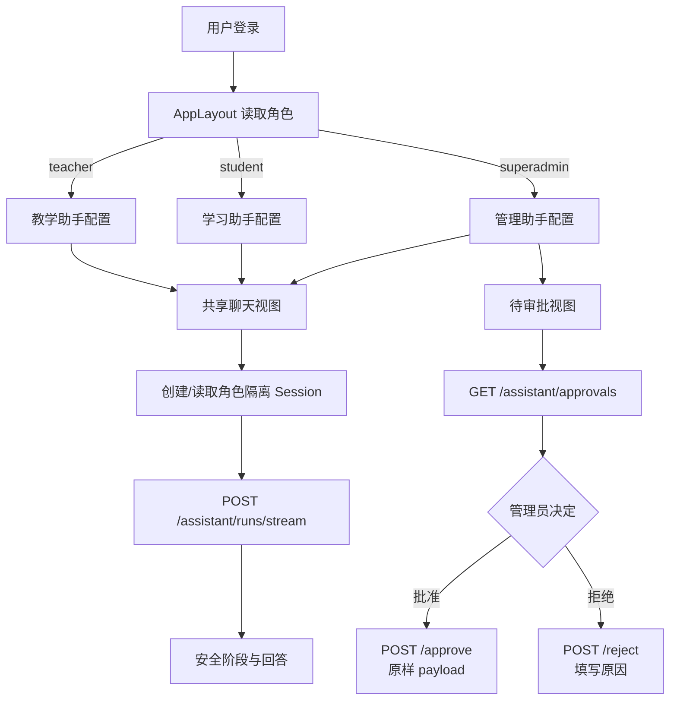

# 多角色助手前端接入设计

> 状态：已确认  
> 日期：2026-07-25  
> 范围：学生端、管理员端助手接入，以及完成联调所需的环境与类型修复

## 1. 目标

在不复制三套聊天面板的前提下，让现有悬浮助手根据登录角色自动切换能力：

- 教师继续使用现有教学助手。
- 学生使用学习助手，访问学习辅导、本人反馈解释和学习规划能力。
- 管理员使用管理助手，访问聚合运营、脱敏审计和模型治理能力。
- 管理员可以在助手面板内查看本人待审批 ActionDraft，并批准或拒绝。
- 指定 Python 环境能够加载 Celery、Psycopg 3 和 LangGraph PostgreSQL
  Checkpointer。
- 本次涉及的前端代码和全仓 TypeScript 类型检查均通过。

## 2. 非目标

- 不重做整套后台视觉主题。
- 不新增独立的学生助手页面或管理员助手页面。
- 不允许学生查看其他学生、教师内部数据或可直接提交的作业答案。
- 不在前端生成审批哈希、幂等键或可信风险等级。
- 不在前端接收或显示 API Key、Access Key、Secret Key。

## 3. 前端组件设计

### 3.1 全局挂载

`frontend/src/layouts/AppLayout.vue` 继续作为唯一挂载点。

`showAssistant` 对以下角色返回 `true`：

- `teacher`
- `student`
- `superadmin`

布局把当前角色传给 `AssistantPanel`。角色只决定展示配置，不作为后端授权依据；
后端身份继续只来自 JWT。

### 3.2 角色配置

创建 `frontend/src/components/assistant/role-config.ts`，集中维护：

- 面板标题
- 空状态欢迎语
- 能力说明
- 输入框占位符
- 安全提示
- 各角色可见视图

配置如下：

| 角色 | 标题 | 主要能力 | 额外视图 |
|---|---|---|---|
| `teacher` | AI 教学助手 | 数据查询、教学策略、批改解释 | 历史记录 |
| `student` | AI 学习助手 | 启发式辅导、反馈解释、学习规划 | 历史记录 |
| `superadmin` | AI 管理助手 | 运营、审计、模型治理 | 历史记录、待审批 |

未知角色不显示助手，不能回退为教师能力。

### 3.3 面板拆分

保留 `AssistantPanel.vue` 作为外壳和状态协调器，新增：

- `AssistantChatView.vue`：消息、阶段、输入、停止生成。
- `AssistantHistoryView.vue`：会话列表和加载历史。
- `AssistantApprovalView.vue`：管理员审批列表、详情、批准和拒绝。
- `role-config.ts`：纯角色配置。

外壳负责：

- 当前视图切换。
- 当前 session/run 状态。
- SSE 生命周期和取消。
- 根据角色决定是否展示审批入口。

审批视图不直接访问 Vuex，只接收 API 数据并发出完成事件。

## 4. API 设计

扩展 `frontend/src/api/assistant.ts`：

- `listApprovals(status?)`
- `approveAction(approvalId, payload)`
- `rejectAction(approvalId, reason)`

结构化类型：

- `AssistantApproval`
- `ApprovalStatus`
- `ApprovalActionType`

批准时必须原样提交服务端返回的 `parameters`，不允许前端悄悄修改。
拒绝时必须输入非空原因。

后端继续负责：

- 当前用户归属校验。
- 角色和对象权限复验。
- payload hash 校验。
- 过期校验。
- 并发审批行锁。
- MySQL 幂等执行账本。

## 5. 交互流程

## 6. 错误处理

- 会话创建失败：保留本地消息，显示稳定错误提示。
- SSE `run.failed`：显示后端安全消息，不显示堆栈。
- 审批列表失败：显示重试按钮，不影响聊天。
- 审批已过期、已执行或载荷冲突：刷新列表并显示服务端消息。
- 用户关闭面板或点击停止：本地 AbortController 与后端 cancel API 双重取消。
- 学生请求完整作业答案：正常展示后端防代写拒绝，不作为前端错误。

## 7. 安全与隐私

- Markdown 输出必须经过 HTML 清理后再传给 `v-html`，避免模型输出脚本。
- 阶段映射不得显示内部 Agent 名称、工具参数和数据库 ID。
- 管理员审批卡片只显示服务端允许返回的 ActionDraft 字段。
- 未知字段使用安全 JSON 预览，不执行、不插入 HTML。
- 角色切换或登出时清空当前 session、消息和审批缓存。

## 8. 测试策略

### 8.1 前端单元测试

- 三角色配置映射。
- 学生和管理员均显示悬浮助手。
- 学生没有审批入口。
- 管理员可以进入审批视图。
- 审批批准提交原始 payload。
- 拒绝原因不能为空。
- SSE 学生/管理员阶段映射使用用户可读中文。
- Markdown 中的脚本和危险属性被清理。

### 8.2 后端与环境验证

- 指定环境可以导入 `celery`、`psycopg`、
  `langgraph.checkpoint.postgres.PostgresSaver`。
- 后端完整 pytest 通过。
- PostgreSQL 和 Celery 专项测试通过。

### 8.3 构建与联调

- `npm test`
- `npx vue-tsc --noEmit`
- `npm run build-only`
- `docker compose config --quiet`
- 浏览器分别登录学生和管理员账号，验证助手打开、聊天、历史、取消和审批。

## 9. 完成定义

同时满足以下条件才视为完成：

1. 指定 Python 环境依赖完整，后端测试零失败。
2. 学生和管理员均能在 `AppLayout` 打开角色正确的助手。
3. 管理员审批列表、批准、拒绝均可用。
4. 学生端不存在审批入口，防代写提示清晰。
5. 前端测试、类型检查和构建全部通过。
6. 浏览器完成学生与管理员关键流程验证。
7. `AGENT_ARCHITECTURE.md` 同步前端接入状态和验证结果。
